本文按「简单 → 中等 → 超复杂」三档构造各图型样本，验证自适应比例、缩放控件与布局在信息量增大时的表现。重点场景：**超长时间线甘特图**（约 190 天 / 20+ 任务 / 长任务名）。

## 1. 甘特图（用户重点场景：时间线拉长）

### 1.1 简单：6 任务 / 2 周

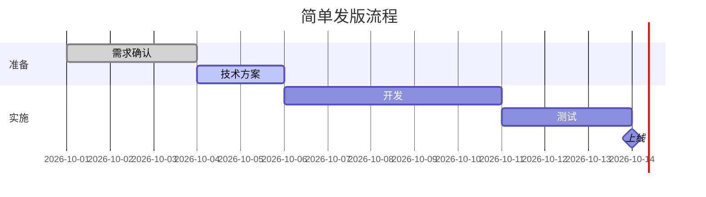

### 1.2 中等：12 任务 / 2 个月

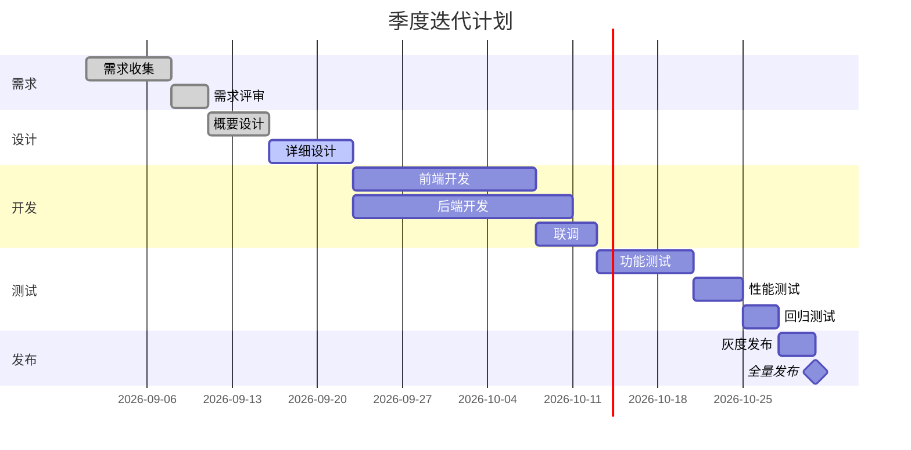

### 1.3 超复杂：20+ 任务 / 约 190 天 / 长任务名 / 多 section

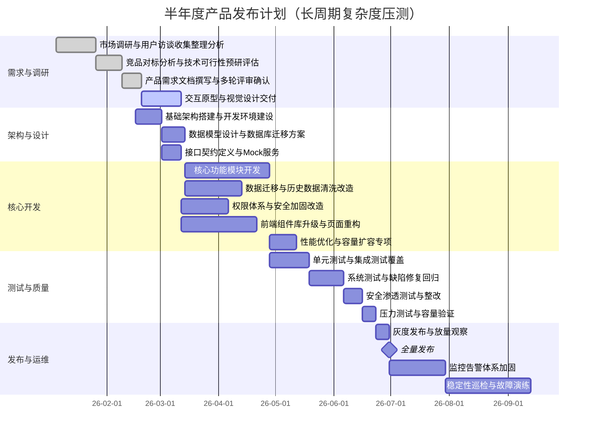

## 2. 流程图

### 2.1 简单：3 节点

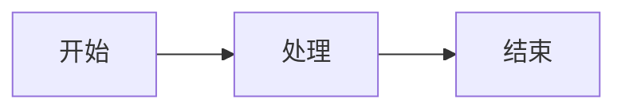

### 2.2 中等：12 节点 / 分支

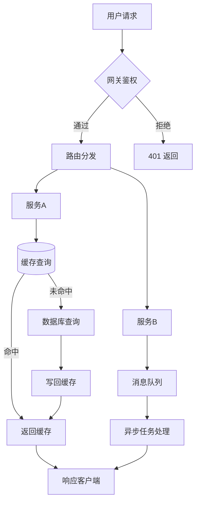

### 2.3 超复杂：25+ 节点 / 多分支 / 跨列

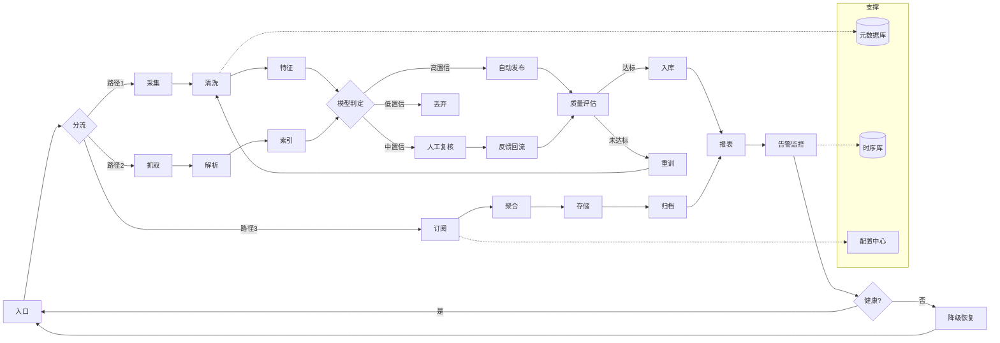

## 3. 时序图

### 3.1 简单：3 参与方

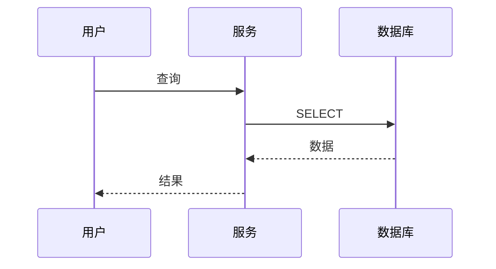

### 3.2 中等：6 参与方 / 循环

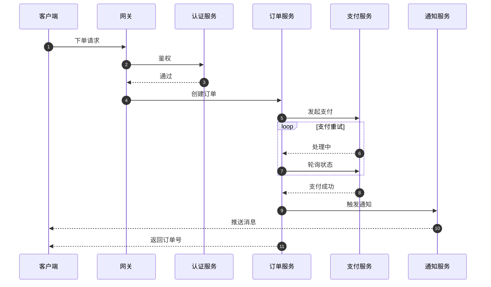

### 3.3 超复杂：10 参与方 / 嵌套

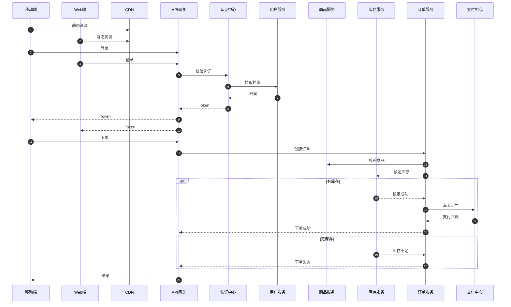

## 4. 时间线

### 4.1 简单：5 事件

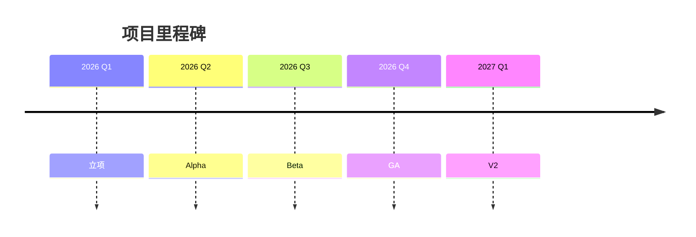

### 4.2 超复杂：18 事件 / 长文本

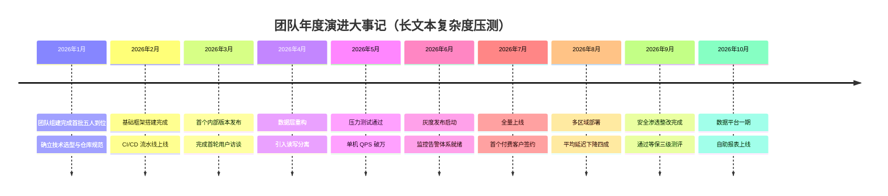

## 5. 类图

### 5.1 简单：3 类

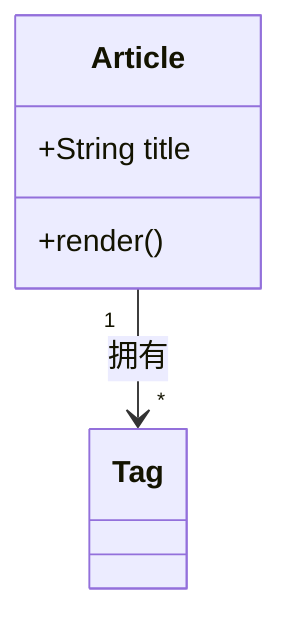

### 5.2 超复杂：12 类 / 多关系

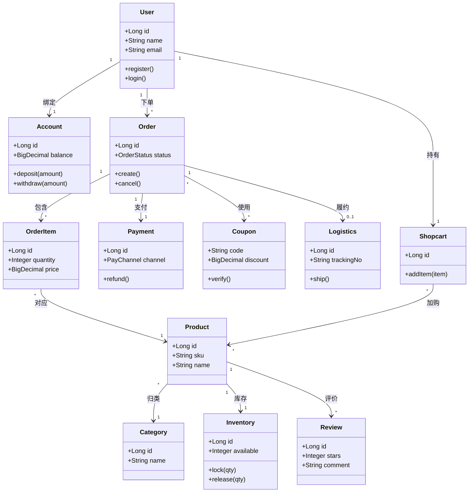

## 6. ER 图

### 6.1 简单：4 实体

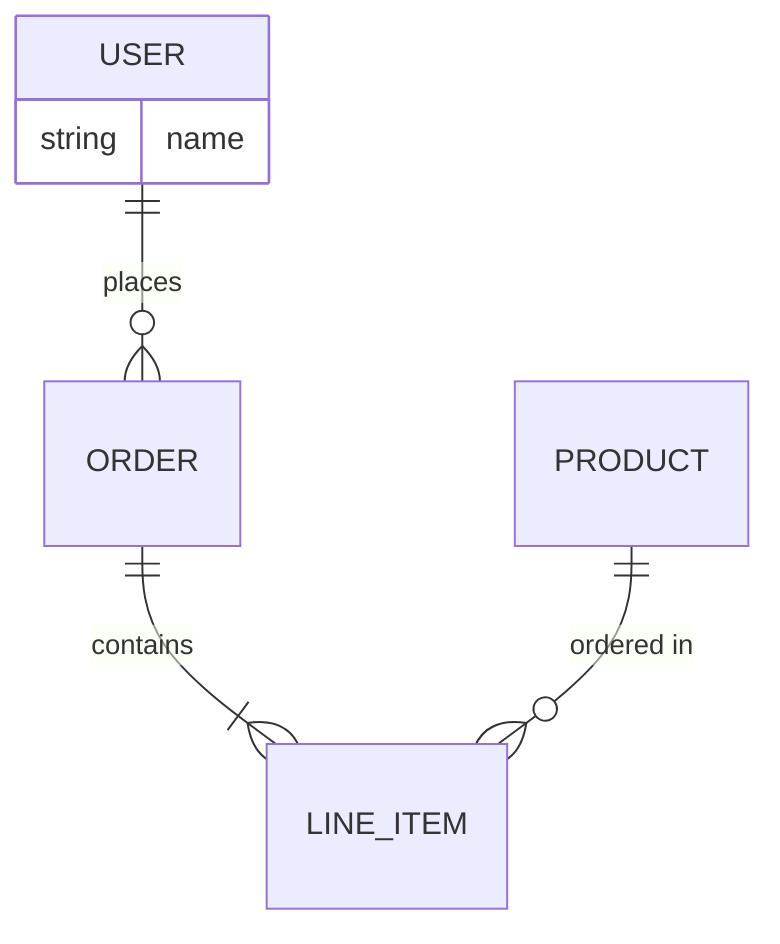

### 6.2 超复杂：10 实体

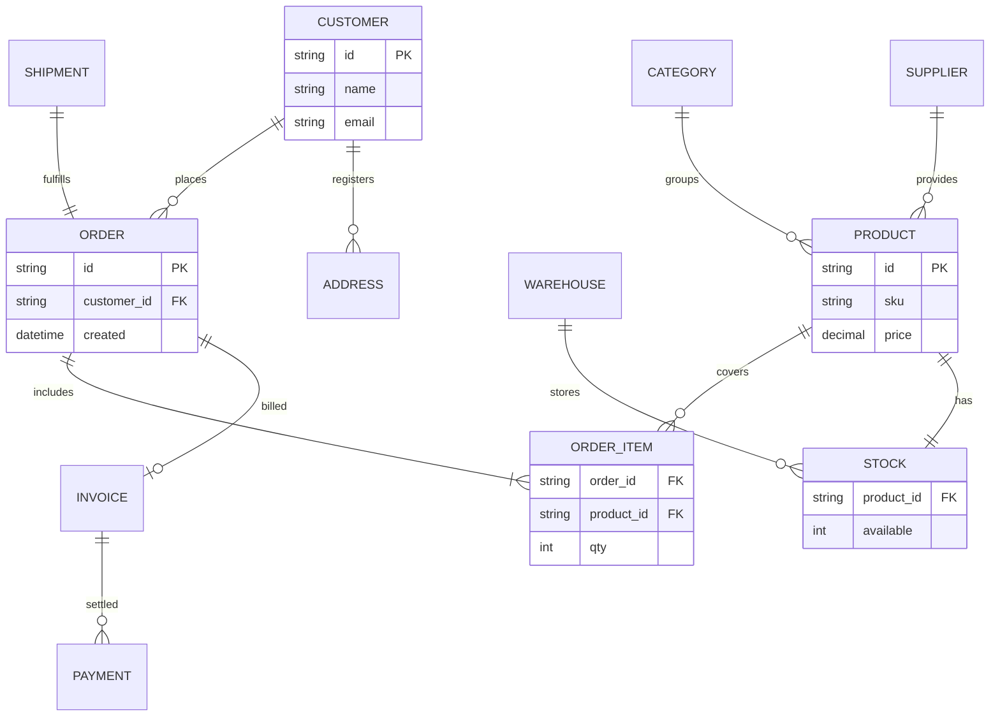

## 7. 用户旅程

### 7.1 简单：4 步

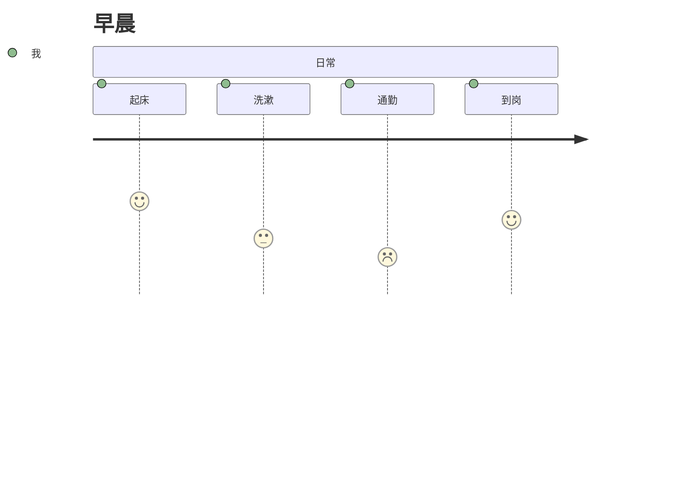

### 7.2 超复杂：12 步 / 多角色

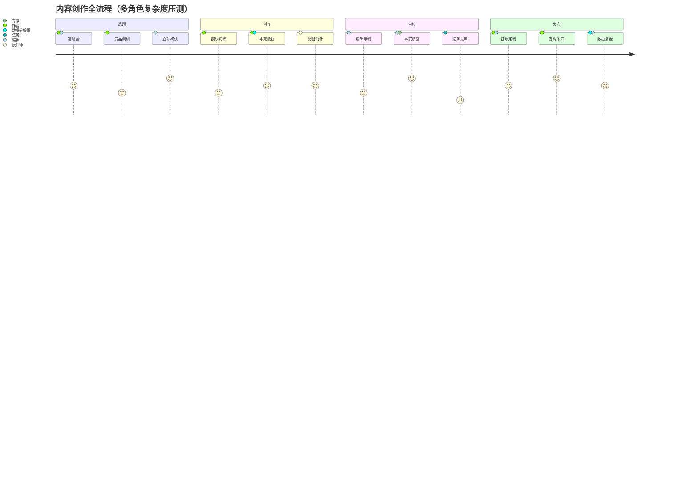

## 8. 状态图

### 8.1 简单

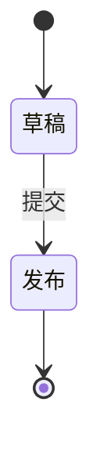

### 8.2 超复杂：10+ 状态

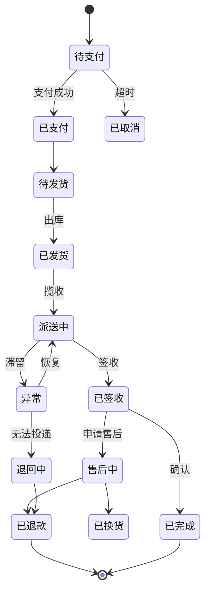

## 9. 饼图

### 9.1 简单：4 片

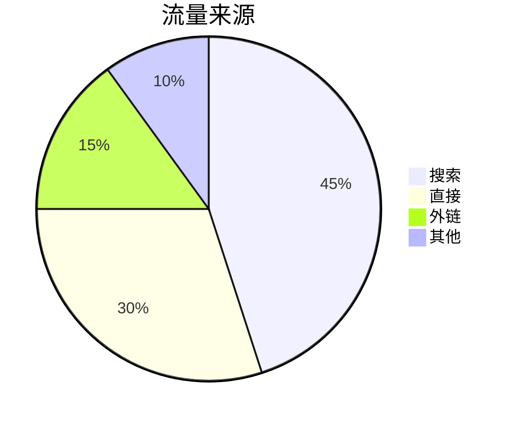

### 9.2 超复杂：10 片

```mermaid
pie title 内容类型分布（多切片复杂度压测）
    "技术长文" : 22
    "技术短篇" : 18
    "随笔杂谈" : 15
    "翻译转载" : 12
    "读书笔记" : 10
    "工具推荐" : 8
    "周报汇总" : 6
    "摄影相册" : 4
    "影评剧评" : 3
    "碎碎念" : 2
```

## 10. 思维导图

### 10.1 简单

```mermaid
mindmap
  root((博客))
    写作
    阅读
```

### 10.2 超复杂：多分支深叶

```mermaid
mindmap
  root((技术体系))
    前端
      框架
        React
        Vue
        Svelte
      工程化
        Vite
        Turbopack
      样式
        Tailwind
        CSS变量
    后端
      语言
        Node.js
        Go
        Rust
      存储
        MySQL
        PostgreSQL
        Redis
      消息
        Kafka
        RocketMQ
    基础设施
      容器
        Docker
        K8s
      观测
        日志
        指标
        追踪
    质量
      测试
        单元
        E2E
      安全
        审计
        扫描
```

## 11. Git 图

### 11.1 超复杂：多分支

```mermaid
gitGraph
    commit id: "init"
    branch develop
    commit
    commit
    branch feature/auth
    commit
    commit
    checkout main
    merge develop tag: "v0.9"
    checkout feature/auth
    commit
    checkout main
    merge feature/auth
    branch feature/pay
    commit
    commit
    commit
    checkout develop
    merge feature/pay
    checkout main
    merge develop tag: "v1.0"
    branch hotfix
    commit
    checkout main
    merge hotfix tag: "v1.0.1"
```

## 12. 象限图

### 12.1 超复杂：8 数据点 / 长标签

```mermaid
quadrantChart
    title 任务优先级矩阵（多点复杂度压测）
    x-axis 低投入 --> 高投入
    y-axis 低回报 --> 高回报
    quadrant-1 重点投入
    quadrant-2 快速回报
    quadrant-3 谨慎评估
    quadrant-4 逐步淘汰
    重构核心支付链路: [0.82, 0.88]
    优化首页首屏加载: [0.45, 0.85]
    新增暗色主题模式: [0.25, 0.62]
    建设自动化测试: [0.7, 0.75]
    迁移老旧PHP模块: [0.88, 0.4]
    社区内容运营: [0.35, 0.5]
    修复若干视觉细节: [0.18, 0.28]
    评估新数据库选型: [0.6, 0.55]
```
