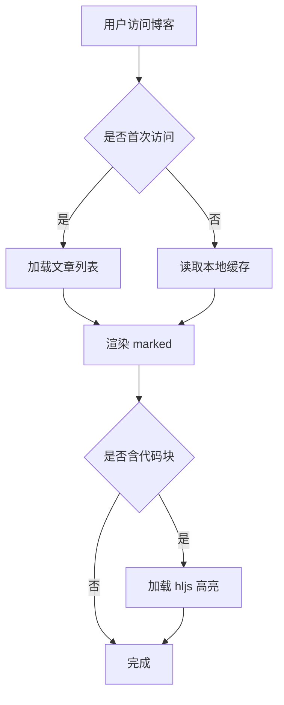
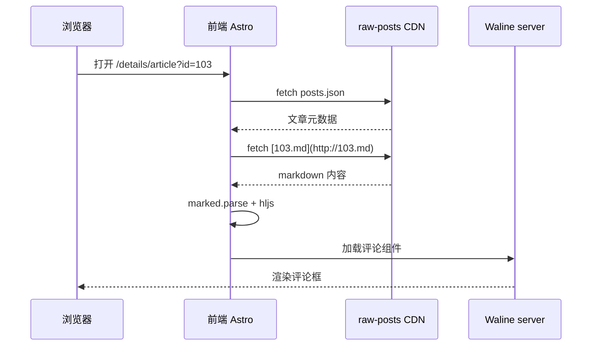
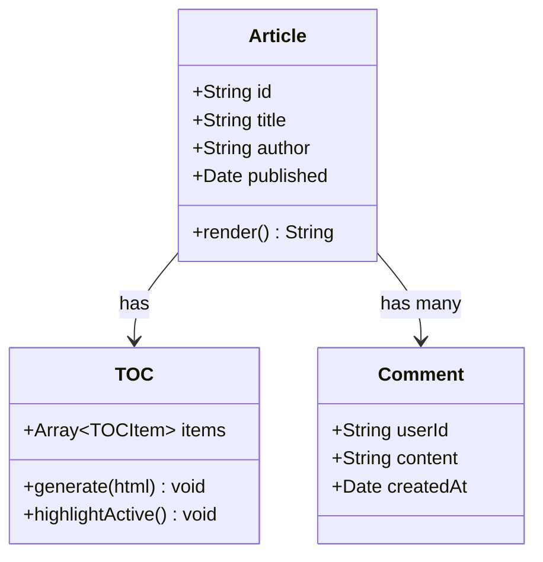
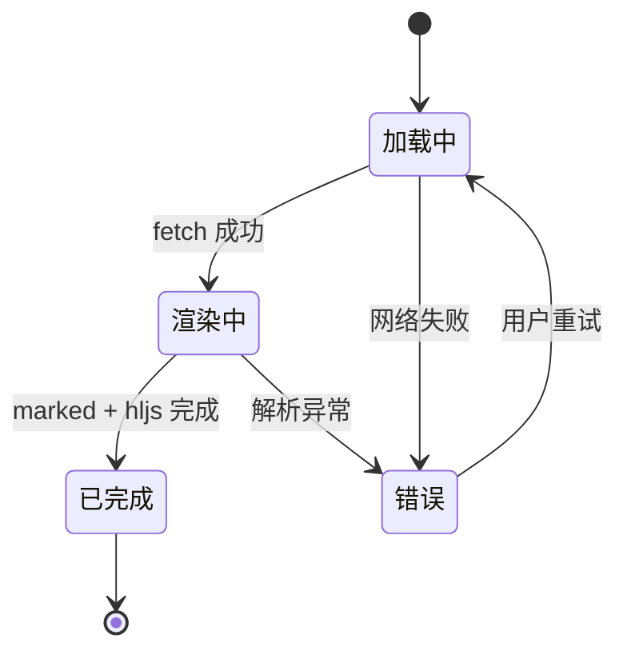
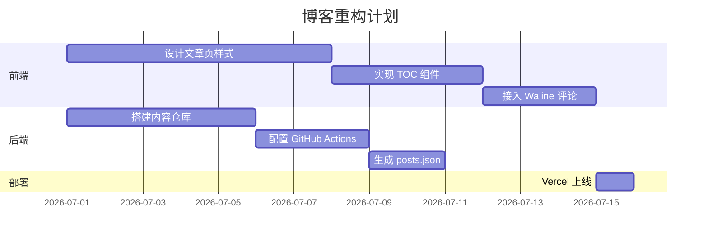
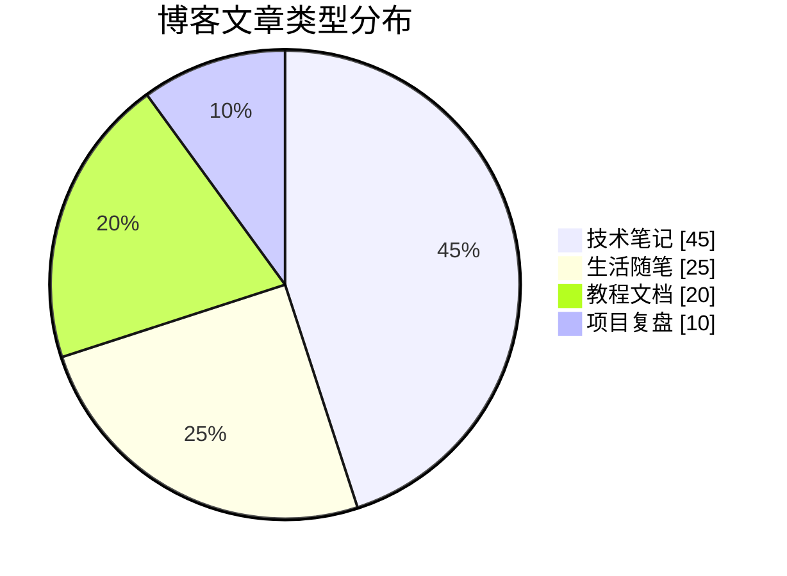
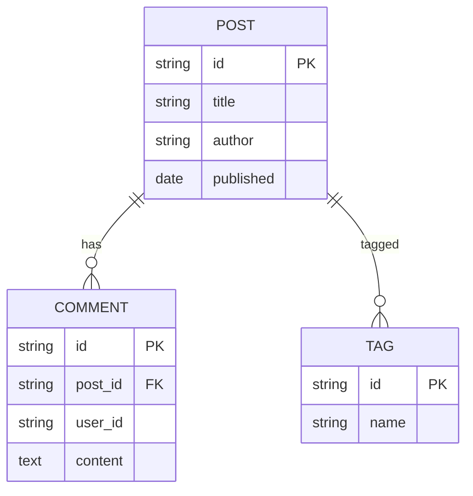
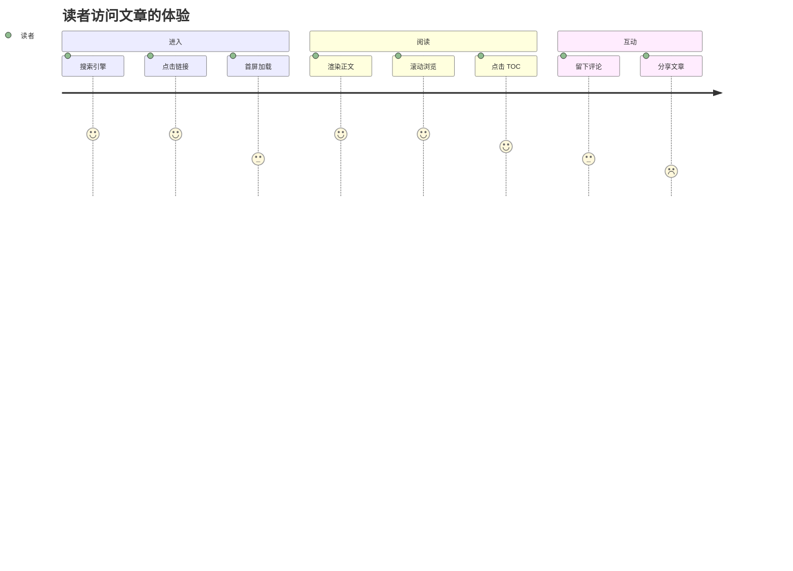
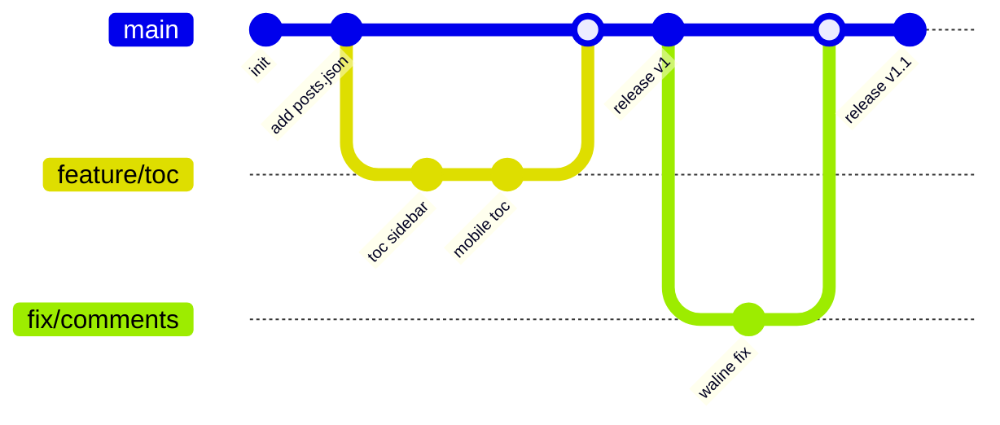

本文仅用于测试 Mermaid 各类图表的渲染。

### 1. Flowchart 流程图

### 2. Sequence Diagram 时序图

### 3. Class Diagram 类图

### 4. State Diagram 状态图

### 5. Gantt Chart 甘特图

### 6. Pie Chart 饼图

### 7. ER Diagram 实体关系图

### 8. User Journey 用户旅程

### 9. Git Graph 提交图

