本文是博客 Markdown 扩展语法的**完整演示**：先逐一列举全部组件，再给出**嵌套组合矩阵**。所有组件由 `moara-md` 扩展层渲染（浏览器端与 `/posts/<id>` 直出共用同一实现，产物一致）。

> [!NOTE]
> 提示框（Admonition）共 **13 种类型**：`NOTE` `ABSTRACT` `INFO` `TIP` `SUCCESS` `QUESTION` `WARNING` `FAILURE` `DANGER` `BUG` `EXAMPLE` `QUOTE` `IMPORTANT`。全部默认可折叠；同义别名（`TLDR` `CAUTION` `ERROR` 等）自动归并。

> [!TIP]+ 可折叠提示框
> 尾缀 `+` 默认展开，`-` 或无尾缀默认收起。展开/收起为即时切换（无动画、零闪烁）。

> [!WARNING]- 收起状态的警告
> 这一栏默认收起，点击标题即可展开。内部支持嵌套任意块级语法（见下方 §2 / §3 矩阵）。

## 1. 提示框 13 类型全览

> [!NOTE]
> 备注类型：用于补充说明与背景信息。

> [!ABSTRACT]
> 摘要类型：文章概要、TLDR。

> [!INFO]
> 信息类型：中性提示。

> [!TIP]
> 提示类型：小技巧与最佳实践。

> [!SUCCESS]
> 成功类型：完成状态确认。

> [!QUESTION]
> 问题类型：常见疑问。

> [!WARNING]
> 警告类型：需要注意的事项。

> [!FAILURE]
> 失败类型：出错的场景。

> [!DANGER]
> 危险类型：高风险操作警示。

> [!BUG]
> 缺陷类型：已知问题记录。

> [!EXAMPLE]+ 示例类型（已展开）
> 示例类型默认展开的样子：内部可以继续嵌套**行内元素** <mark>标记</mark>、<kbd>Ctrl</kbd> 按键、:spoiler[黑幕] 与[链接](https://example.com)。

> [!QUOTE]
> 引用类型：摘录他人观点。

> [!IMPORTANT]
> 重要类型：关键结论。

别名归一演示（`CAUTION` → 警告色、`TLDR` → 摘要色）：

> [!CAUTION]
> 这是 `CAUTION` 别名，渲染为 warning 样式。

> [!TLDR]
> 这是 `TLDR` 别名，渲染为 abstract 样式。

## 2. 折叠面板 :::folding

折叠面板取代了旧版手写 HTML。**内部支持所有块级语法**：列表、表格、代码块、甚至嵌套折叠。

:::folding{title="点击展开 — 查看代码块与列表"}

- 列表项一
- 列表项二
- 列表项三

```ts
export interface Post {
  id: string;
  title: string;
  html: string;
}
```

:::

:::folding{title="嵌套折叠：外层面板" open}

外层默认展开（`open` 属性）。内层默认收起，**内层里面还有第三层**：

:::folding{title="内层折叠 — 双层嵌套"}

内层折叠内容：内层面板内部再嵌一层：

:::folding{title="三层折叠 — 第三层"}

这里是在折叠内、折叠内的**第三层折叠**——外层、内层、第三层逐层缩进嵌套。

:::

:::

:::

### 折叠面板内的组件全家桶

以下折叠面板**默认展开**，内部逐项演示每种组件的嵌套形态：

:::folding{title="组件全家桶：折叠内嵌套一切" open}

普通段落：折叠面板内的正文文字，支持**加粗**、*斜体*、`行内代码`、[链接](https://example.com)。

无序列表与有序列表：

- 无序项 A
- 无序项 B

1. 有序项一
2. 有序项二

任务列表（GFM）：

- [x] 已完成的任务
- [ ] 待办任务
- [ ] 另一个待办

表格：

| 组件 | 嵌套 | 说明 |
|---|:---:|---|
| 折叠 | ✓ | 任意层级 |
| 选项卡 | ✓ | 见 §3 |
| 提示框 | ✓ | 下一项演示 |

代码块：

```js
console.log('折叠面板内的代码块');
```

提示框：

> [!TIP]
> 折叠面板内的提示框：绿色左边条同样生效。

Mermaid 图表：


数学公式：

$$
E = mc^2 \quad \text{（折叠内公式）}
$$

链接卡与仓库卡：

::linkcard{url="https://github.com/moaradc/MOARA" title="折叠内的链接卡"}

::github{repo="markedjs/marked"}

视频（叶子形式）：

::video{type="bilibili" id="BV1GJ411x7h7" title="折叠内的视频"}

图片与引用块：


> 折叠面板内的引用块（普通 blockquote）。

原生 `<details>`（HTML 直写在折叠内）：

<details>
<summary>折叠内的原生 details</summary>

原生 details 嵌套在 :::folding 内部。

</details>

行内元素一排：<mark>荧光标记</mark>、<kbd>Ctrl</kbd>、:spoiler[黑幕]、H<sub>2</sub>O、x<sup>2</sup>。

:::

## 3. 选项卡 ::::tabs

选项卡两种形态：`{open}` 默认展开；无属性默认折叠（仅标题栏可见）。

:::::tabs{open}

:::tab{title="安装" notoc}

```bash
npm install moara-md
```

面板内小节（`notoc` 属性使标题不进目录）：

### 面板内小节（不进目录）

此处 H3 不会出现在目录卡片中。

:::

:::tab{title="配置与表格"}

选项卡内的表格：

| 项 | 值 |
|---|---|
| 主题 | oklch |
| 字体 | Space Grotesk |

选项卡内的提示框：

> [!EXAMPLE]+ 选项卡内提示框
> 提示框嵌在选项卡面板里，默认展开。

:::

:::tab{title="折叠与代码"}

选项卡内的折叠面板：

:::folding{title="选项卡内的折叠" open}

折叠面板嵌在选项卡面板里，内部再有代码块：

```js
console.log('tabs > folding > code');
```

:::

:::

:::tab{title="图表与公式"}

选项卡内的 Mermaid：

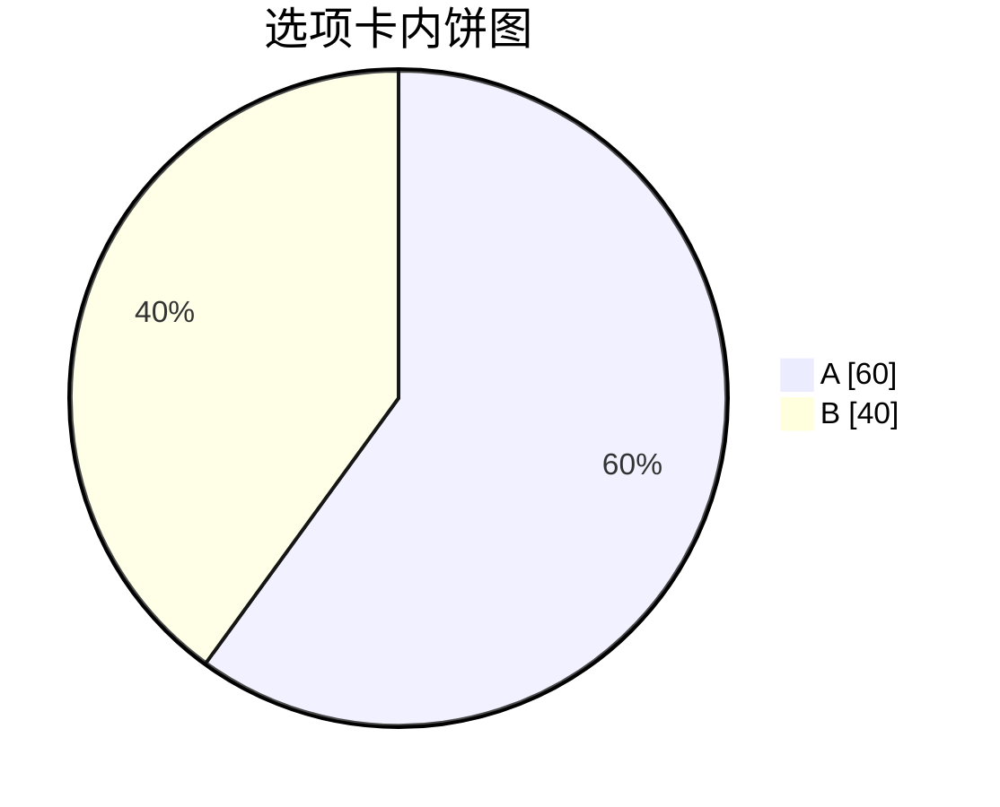

选项卡内的数学：

$$
\int_0^1 x^2 \, dx = \frac{1}{3}
$$

:::

:::tab{title="嵌套选项卡"}

选项卡嵌套选项卡（内层五冒号围栏）：

:::::tabs{open}

:::tab{title="内层 A"}

内层选项卡面板 A。

:::

:::tab{title="内层 B"}

内层选项卡面板 B：嵌套层级不受限制（栈式解析）。

:::

:::::

:::

:::tab{title="卡片与视频"}

选项卡内的叶子指令（单行压缩）：

::linkcard{url="https://github.com/moaradc/MOARA" title="选项卡内链接卡"}

::github{repo="markedjs/marked"}

::video{type="youtube" id="aqz-KE-bpKQ" title="选项卡内视频"}

:::

:::::

横向滑动演示（10 个选项卡，无属性默认折叠）：

:::::tabs

:::tab{title="第 1 步：安装"}

第 1 步内容。

:::

:::tab{title="第 2 步：初始化"}

第 2 步内容。

:::

:::tab{title="第 3 步：配置"}

第 3 步内容。

:::

:::tab{title="第 4 步：迁移"}

第 4 步内容。

:::

:::tab{title="第 5 步：构建"}

第 5 步内容。

:::

:::tab{title="第 6 步：测试"}

第 6 步内容。

:::

:::tab{title="第 7 步：联调"}

第 7 步内容。

:::

:::tab{title="第 8 步：灰度"}

第 8 步内容。

:::

:::tab{title="第 9 步：发布"}

第 9 步内容。

:::

:::tab{title="第 10 步：运维"}

第 10 步内容。

:::

:::::

## 4. 提示框内嵌套容器

提示框（引用块变换）内部同样支持容器指令——每行加 `>` 前缀即可：

> [!INFO]+ 提示框内的折叠面板
> 提示框内部直接嵌套 :::folding：
>
> :::folding{title="提示框内的折叠" open}
>
> 折叠面板渲染在提示框内部。
>
> :::
>
> 提示框内也可以放**普通嵌套引用**：
>
> > 提示框内的一层引用。
> >
> > > 提示框内的两层引用。

> [!QUESTION]+ 提示框内的图表与公式
> ```mermaid
> flowchart LR
>     Q[提示框内] --> R[图表正常]
> ```
>
> $$a^2 + b^2 = c^2$$

> [!NOTE]+ 提示框内的卡片与表格
> ::linkcard{url="https://github.com/moaradc/MOARA" title="提示框内链接卡"}
>
> ::github{repo="markedjs/marked"}
>
> ::video{type="bilibili" id="BV1GJ411x7h7" title="提示框内的视频"}
>
> | 位置 | 卡片 |
> |---|---|
> | 提示框内 | ✓ |

## 5. 视频嵌入 :::video

::::video{type="bilibili" id="BV1GJ411x7h7" title="演示：Bilibili 嵌入"}

::::video{type="youtube" id="aqz-KE-bpKQ" title="演示：YouTube 嵌入"}

直链视频（裸 `<video>` 标签，无外壳跟随原始比例）：

<video src="https://interactive-examples.mdn.mozilla.net/media/cc0-videos/flower.mp4" controls muted title="演示：直链原生视频"></video>

折叠块内既可用叶子形式 `::video`，也可用块形式（见 §2 全家桶）。

## 6. 链接卡片 :::linkcard

:::linkcard{url="https://github.com/moaradc/MOARA" title="MOARA 主仓库"}

:::linkcard{url="https://example.com/docs/guide.pdf" title="文件链接：按后缀显示文件图标"}

:::linkcard{post="103" title="站内文章卡片（标题由目标文章 frontmatter 自动填充）"}

:::linkcard{url="https://www.baidu.com" title="直连 favicon 演示：取自 www.baidu.com/favicon.ico"}

## 7. 仓库卡片 :::github

:::github{repo="markedjs/marked"}

## 8. 数学公式（frontmatter `math: true`）

行内公式 $e^{i\pi} + 1 = 0$ 与块级公式：

$$
\begin{aligned}
\nabla \cdot \mathbf{E} &= \frac{\rho}{\varepsilon_0} \\
\nabla \cdot \mathbf{B} &= 0
\end{aligned}
$$

## 9. 行内元素

- 高亮 <mark>荧光笔标记</mark>（酸绿色，双模式高对比）
- 键盘按键 <kbd>Ctrl</kbd> + <kbd>Alt</kbd> + <kbd>Del</kbd>
- 上下标：H<sub>2</sub>O 与 x<sup>2</sup> + y<sup>2</sup> = r<sup>2</sup>
- 行内黑幕（防剧透）：凶手是 :spoiler[黑衣人]，点击显示。
- 行内代码 `const x = 42;`

## 10. 链接包裹图片与裸图

链接包裹的图片：**点击图片本身打开灯箱**预览；跳转链接收在灯箱的 *i* 信息面板里：

[](https://unsplash.com)

裸图（无链接）点击同样打开灯箱预览：


## 11. 脚注

摩尔 Blog 的脚注语法与 GFM 一致[^gfm]，定义可以写在任意位置[^anywhere]，渲染时统一汇总到文末「注释」区。**未写定义的引用**（如这条[^missing]）按原文显示、不进入注释区；点击脚注不更新地址栏。

[^gfm]: 参见 GitHub Flavored Markdown Spec 的脚注扩展。
[^anywhere]: 引用处按首次出现顺序编号，支持[**行内 Markdown**](https://github.github.com/gfm/) 与多行定义。

## 12. 表格对齐

| 左对齐列 | 居中列 | 右对齐列 |
|:---|:---:|---:|
| GitHub | 1 | 100 |
| 掘金 | 2 | 200 |
| 知乎 | 3 | 300 |
| b 站 | 1 | 1000 |
| 云盘 | 2 | 2000 |
| 邮箱 | 3 | 3000 |

## 13. Mermaid 图表类型全集

`moara-md` 不拦截 Mermaid——交给 `article.js` 加载的 Mermaid 10.9 渲染。常用 12 种图：

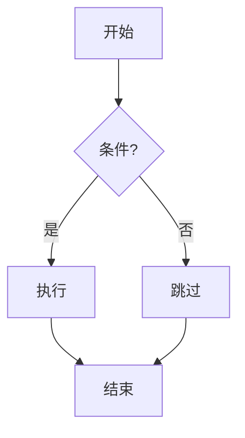

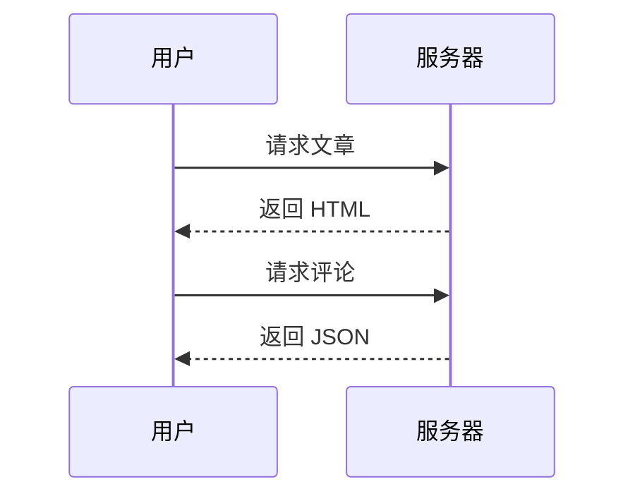

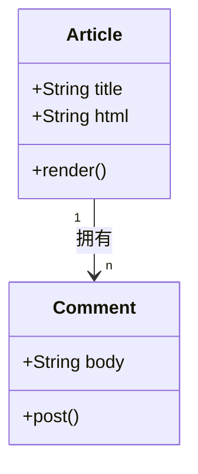

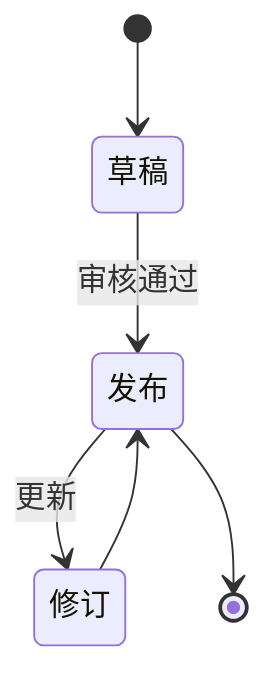

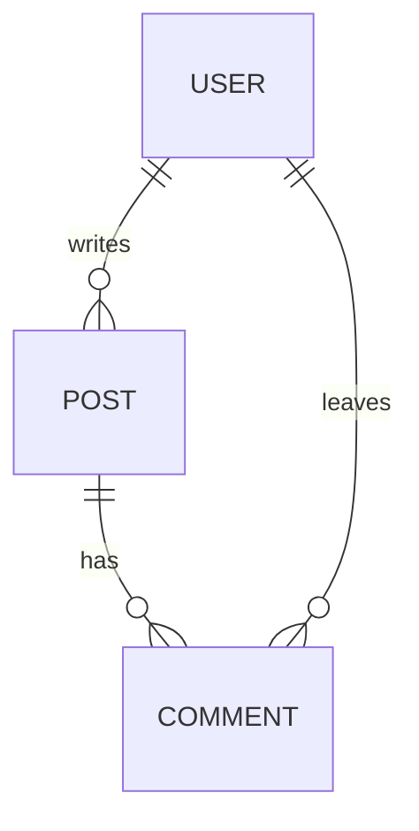

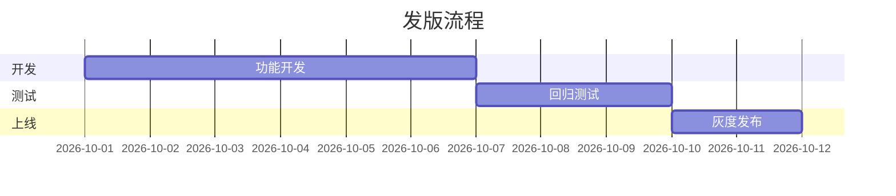

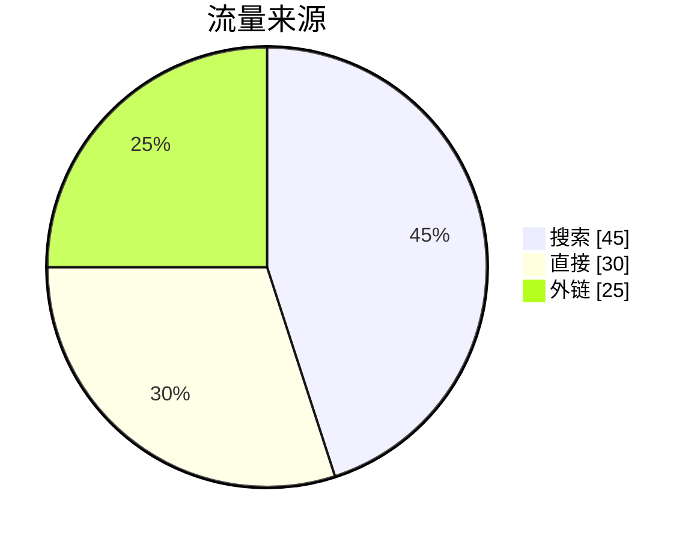

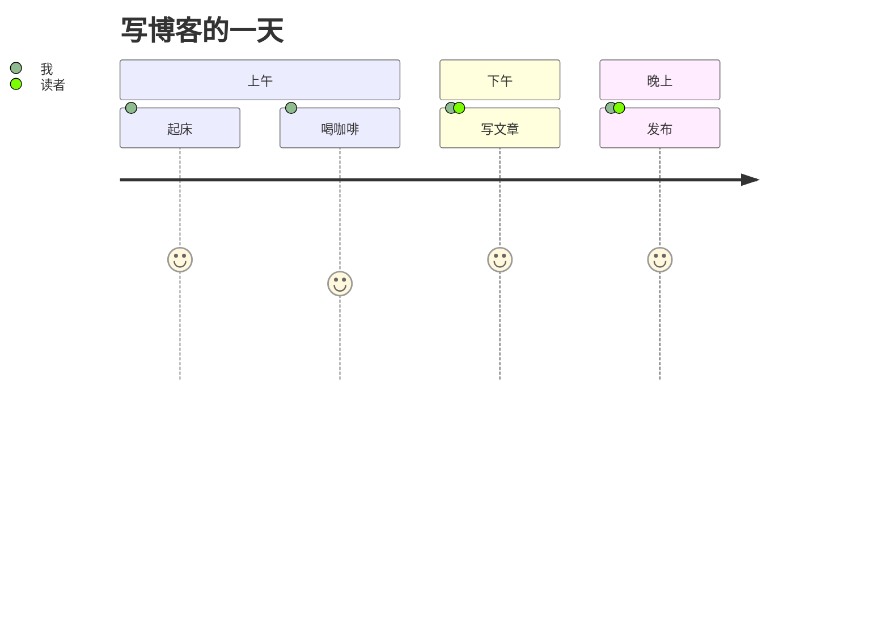

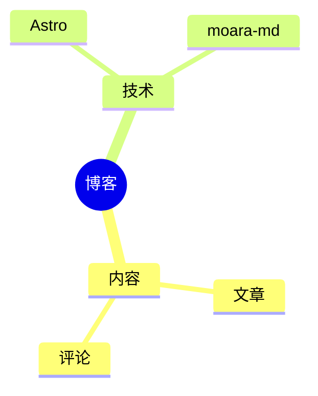

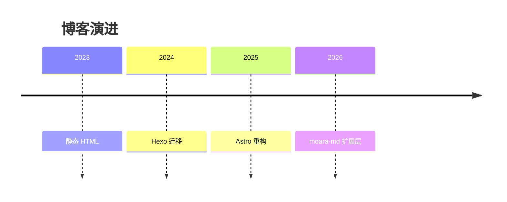

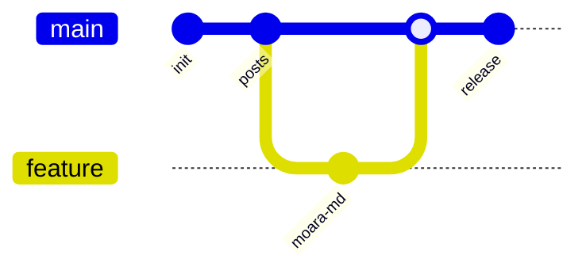

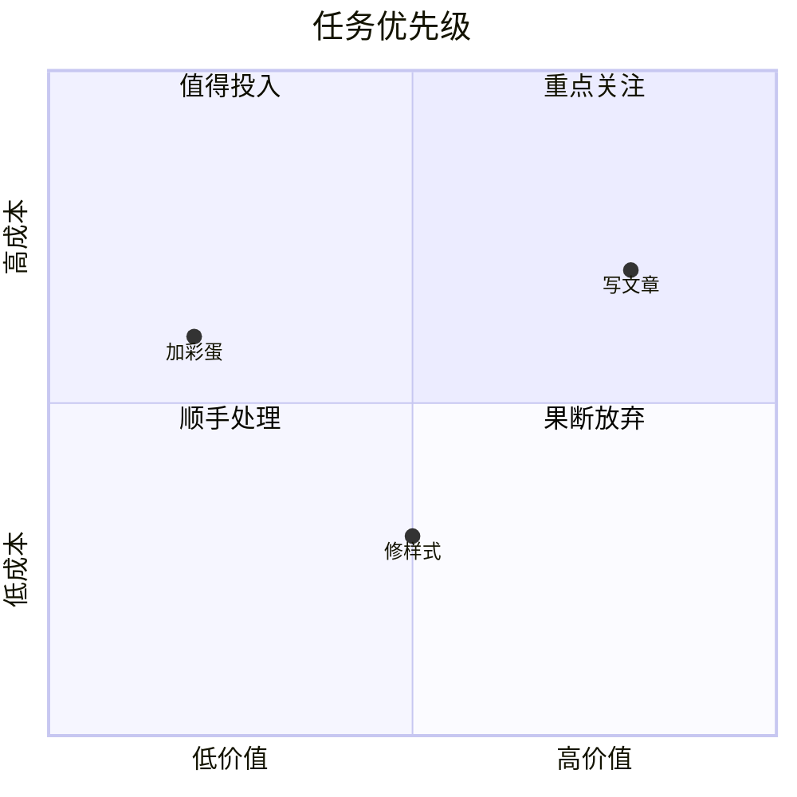

## 14. 原生 details 折叠

标准 HTML 折叠（与 `:::folding` 视觉风格统一）：

<details>
<summary>原生 details 折叠示例</summary>

内部同样支持 Markdown 语法（约定 summary 与内容间**保留空行**）。

- 项目 A
- 项目 B

</details>

<details>
<summary>原生 details（HTML 直写）</summary>

与 `:::folding` 视觉统一，垂直节奏同 0.8rem——用于校验裸 `<details>` 标签的留白一致性。

</details>

<details open>
<summary>默认展开 + 内部嵌套</summary>

原生 details 内的提示框与代码：

> [!TIP]
> 提示框嵌在原生 details 里。

```js
console.log('details > code');
```

</details>

## 15. 图集标签（可选 links）

<gallery src="https://picsum.photos/seed/a/600/400, https://picsum.photos/seed/b/600/750, https://picsum.photos/seed/c/600/600, https://picsum.photos/seed/d/600/800" links="https://unsplash.com, https://github.com, , "></gallery>

`links` 属性与 `src` 逐项对应：**有链接的项**跳转外链，**空项**维持灯箱预览。

## 16. 长代码块自动折叠

超过 300px 高的代码块自动折叠，底部出现展开按钮：

```ts
// 长代码块折叠演示：mac-code-block 超高自动收起
type Result<T> = { ok: true; value: T } | { ok: false; error: Error };

async function fetchPost(id: string): Promise<Result<string>> {
    const res = await fetch(`/posts/${id}.html`);
    if (!res.ok) return { ok: false, error: new Error(String(res.status)) };
    const html = await res.text();
    return { ok: true, value: html };
}

function parseFrontmatter(md: string): { data: Record<string, unknown>; body: string } {
    const m = md.match(/^---\n([\s\S]*?)\n---\n/);
    if (!m) return { data: {}, body: md };
    const data: Record<string, unknown> = {};
    for (const line of m[1].split('\n')) {
        const idx = line.indexOf(':');
        if (idx < 2) continue;
        const key = line.slice(0, idx).trim();
        const raw = line.slice(idx + 1).trim();
        try { data[key] = JSON.parse(raw); } catch { data[key] = raw; }
    }
    return { data, body: md.slice(m[0].length) };
}

const DEMO_LINES = Array.from({ length: 20 }, (_, i) =>
    `console.log('line ${i + 1} of the long code demo');`);

DEMO_LINES.forEach((l) => eval(l));

async function main() {
    const r = await fetchPost('test001');
    if (r.ok) {
        const { body } = parseFrontmatter(r.value);
        console.log(body.slice(0, 80));
    } else {
        console.error(r.error);
    }
}

main();
```

## 17. 嵌套矩阵速查

下表汇总本文实际演示过的嵌套组合（✓ 均有对应段落）：

| 内层组件 \ 外层 | 顶层 | 折叠内 | 选项卡内 | 提示框内 | 原生 details 内 |
|---|:---:|:---:|:---:|:---:|:---:|
| 段落 / 列表 / 任务列表 | ✓ | ✓ §2 | ✓ §3 | ✓ §4 | ✓ §14 |
| 表格 | ✓ §12 | ✓ §2 | ✓ §3 | ✓ §4 | — |
| 代码块 / 长代码 | ✓ §16 | ✓ §2 | ✓ §3 | ✓ §4 | ✓ §14 |
| 提示框 | ✓ §1 | ✓ §2 | ✓ §3 | —（用嵌套引用 §4） | ✓ §14 |
| 折叠面板（含三层） | ✓ §2 | ✓ §2 | ✓ §3 | ✓ §4 | — |
| 选项卡（含嵌套选项卡） | ✓ §3 | — | ✓ §3 | — | — |
| Mermaid（12 类型） | ✓ §13 | ✓ §2 | ✓ §3 | ✓ §4 | — |
| 视频（iframe / 直链） | ✓ §5 | ✓ §2 | ✓ §3 | — | — |
| 链接卡 / 仓库卡 | ✓ §6-7 | ✓ §2 | ✓ §3 | ✓ §4 | — |
| 数学公式 | ✓ §8 | ✓ §2 | ✓ §3 | ✓ §4 | — |
| 原生 details | ✓ §14 | ✓ §2 | — | — | — |
| 行内元素（mark/kbd/spoiler 等） | ✓ §9 | ✓ §2 | ✓ §3 | ✓ §1 | ✓ §14 |
| 图集 gallery | ✓ §15 | — | — | — | — |

引擎要点：容器指令**栈式解析**（`::::tabs` > `:::tab` > `:::folding` 逐层闭合）；提示框先于容器变换，内部容器每行加 `>` 前缀；`::video` `::linkcard` `::github` 为叶子指令，容器内压缩为单行。
