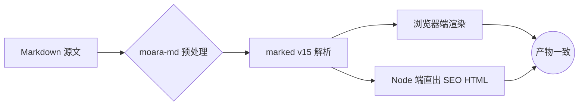

本文是博客 Markdown 扩展语法的**完整演示**，全部组件均由 `moara-md` 扩展层渲染（浏览器端与 `/posts/<id>` 直出共用同一实现，产物一致）。

> [!NOTE]
> 提示框（Admonition）支持 12 种类型：`NOTE` `TIP` `INFO` `IMPORTANT` `WARNING` `CAUTION` `DANGER` `ABSTRACT` `EXAMPLE` `QUOTE` `SUCCESS` `QUESTION`，同义写法（如 `TIP`/`IMPORTANT`）自动归并。

> [!TIP]+ 可折叠提示框
> 尾缀 `+` 默认展开，`-` 默认收起。折叠态的提示框与折叠面板共享同一套动画协议。

> [!WARNING]- 收起状态的警告
> 这一栏默认收起，点击标题即可展开。支持嵌套任意块级语法。

## 1. 折叠面板 :::folding

折叠面板取代了旧版手写 HTML（旧语法不再推荐）。**内部支持所有块级语法**：列表、表格、代码块、甚至嵌套折叠。

:::folding{title="点击展开 — 查看代码块与列表"}

- 列表项一
- 列表项二
- 列表项三

```ts
export interface AdvancedConfig {
  /** 是否启用实验特性 */
  experimental?: boolean;
}
export const advancedConfig: AdvancedConfig = { experimental: true };
```

| 参数 | 类型 | 默认值 |
| :--- | :---: | ---: |
| left | string | - |
| center | number | 0 |
| right | boolean | true |

:::

:::folding{title="嵌套折叠：外层面板" open}

外层默认展开（`open` 属性）。内部可以继续嵌套折叠：

:::folding{title="内层折叠 — 双层嵌套"}

内层内容：代码、列表、表格在折叠区内**正常渲染**（旧版语法做不到这一点）。

```python
print('Nested folding works!')
```

:::

:::

## 2. 选项卡 ::::tabs

::::tabs

:::tab{title="NPM"}

使用 npm 安装（默认选项卡）：

```bash
npm install moara
```

:::

:::tab{title="PNPM"}

使用 pnpm 安装：

```bash
pnpm add moara
```

:::

:::tab{title="源码构建" notoc}

从源码构建（本面板标题带 `notoc` 属性，面板内标题不进入文章目录）：

### 面板内小节（不进目录）

```bash
git clone https://github.com/moaradc/MOARA
cd MOARA && npm ci && npm run build
```

:::

::::

## 3. 视频嵌入 :::video

:::video{type="bilibili" id="BV1GJ411x7h7" title="演示：Bilibili 嵌入"}

:::video{type="youtube" id="aqz-KE-bpKQ" title="演示：YouTube 嵌入"}

折叠块内推荐使用**叶子形式** `::video`（无需闭合围栏）：

:::folding{title="折叠面板内的视频"}

::video{url="https://www.w3schools.com/html/mov_bbb.mp4" title="演示：直链原生播放器"}

:::

## 4. 链接卡片 :::linkcard

:::linkcard{url="https://github.com/moaradc/MOARA" title="MOARA 主仓库"}

:::linkcard{url="https://example.com/docs/guide.pdf" title="文件链接：按后缀显示文件图标"}

:::linkcard{post="103" title="站内文章卡片（运行时解析标题）"}

## 5. 仓库卡片 :::github

:::github{repo="markedjs/marked"}

## 6. 数学公式（frontmatter `math: true`）

质能方程 $E = mc^2$ 与质能方程行内形式 $E = mc^2$ 可以混排。块级公式使用 `$$`：

$$
\mathcal{F}(\omega) = \int_{-\infty}^{\infty} f(t)\, e^{-i\omega t}\, dt
$$

矩阵与对齐：

$$
\begin{pmatrix} a & b \\ c & d \end{pmatrix}
\begin{pmatrix} x \\ y \end{pmatrix}
=
\begin{pmatrix} ax + by \\ cx + dy \end{pmatrix}
$$

## 7. 行内元素

- 高亮 <mark>荧光笔标记</mark>（酸绿色，双模式高对比）
- 键盘按键 <kbd>Ctrl</kbd> + <kbd>Alt</kbd> + <kbd>Del</kbd>
- 上下标：H<sub>2</sub>O 与 x<sup>2</sup> + y<sup>2</sup> = r<sup>2</sup>
- 行内黑幕（防剧透）：凶手是 :spoiler[黑衣人]，点击显示。
- 行内代码 `const x = 42;`

## 8. 链接包裹图片（常驻跳转角标）

点击下图会**跳转到目标链接**而不是打开灯箱，图片右上角有常驻角标标识：

[](https://unsplash.com)

裸图（无链接）点击仍打开灯箱预览：


## 9. 脚注

摩尔 Blog 的脚注语法与 GFM 一致[^gfm]，定义可以写在任意位置[^anywhere]，渲染时统一汇总到文末。

[^gfm]: 参见 GitHub Flavored Markdown Spec 的脚注扩展。
[^anywhere]: 引用处按首次出现顺序编号，支持[**行内 Markdown**](https://github.github.com/gfm/) 与多行定义。

## 10. 表格对齐（修复演示）

三列分别**左、中、右**对齐（此前全被居中，现在按分隔行生效）：

| :左对齐 | 居中对齐: | 右对齐: |
| :------------------- | :-------: | ------: |
| b 站 | 1 | 1000 |
| 云盘 | 2 | 2000 |
| 邮箱 | 3 | 3000 |

## 11. Mermaid 图表



## 12. 原生 details 折叠

标准 HTML 折叠（与 `:::folding` 视觉风格统一）：

<details>
<summary>原生 details 折叠示例</summary>

内部同样支持 Markdown 语法（约定 summary 与内容间**保留空行**）。

- 项目 A
- 项目 B

</details>

## 13. 图集标签（可选 links）

<gallery src="https://picsum.photos/seed/a/600/400, https://picsum.photos/seed/b/600/750, https://picsum.photos/seed/c/600/600, https://picsum.photos/seed/d/600/800" links="https://unsplash.com, https://github.com, , ">

`links` 属性与 `src` 逐项对应：**有链接的项**显示跳转角标并跳转，**空项**维持灯箱预览。
