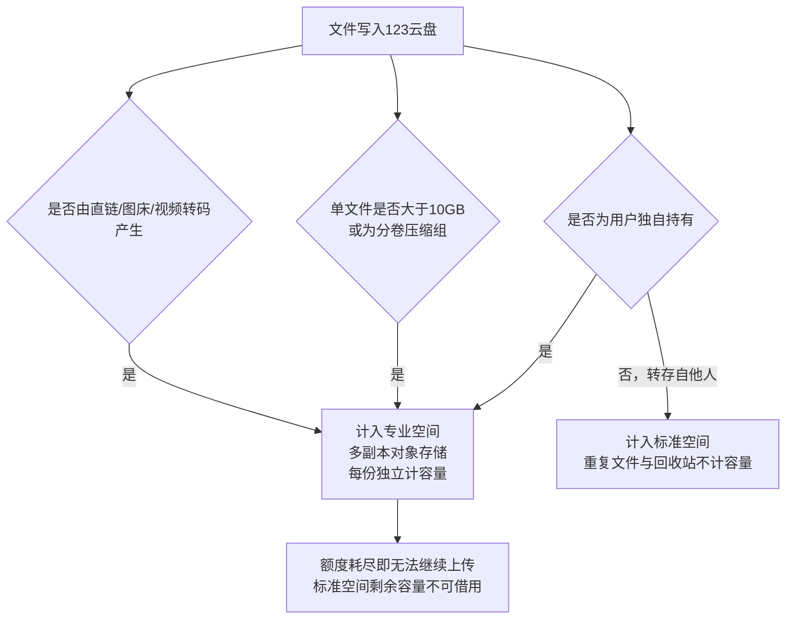
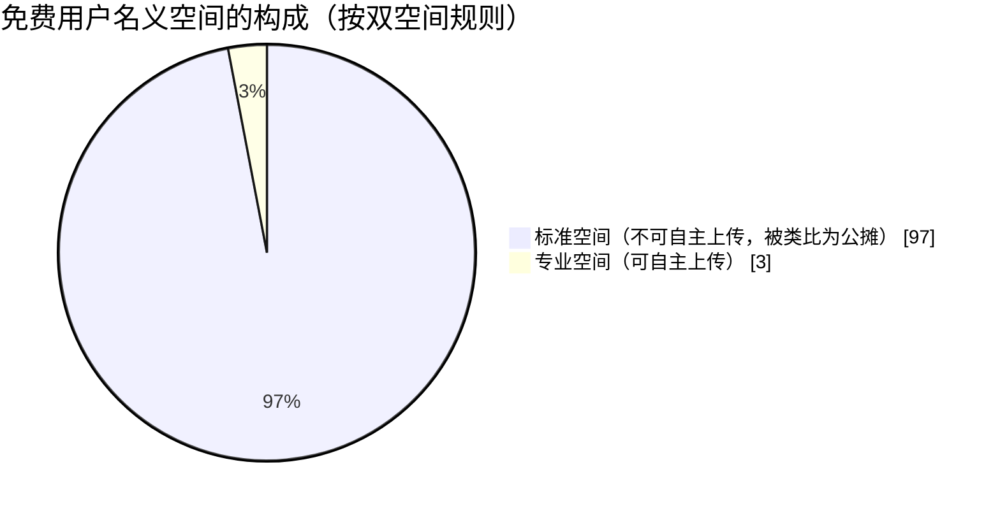
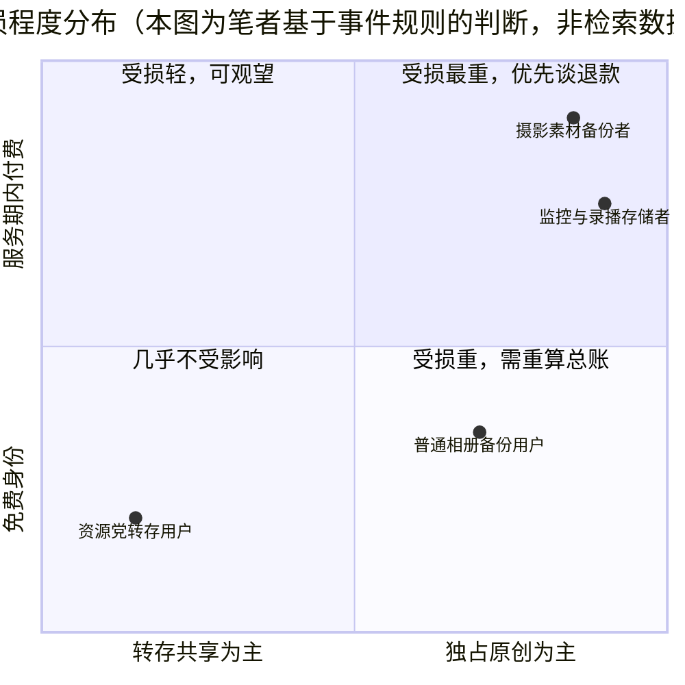

**报告日期：2026年10月8日** Qwen3.8-Flash

## 摘要

2026年9月24日14:30，123云盘把运行多年的单一存储空间拆成"标准空间"与"专业空间"两套互不通用的额度：标准空间承载靠去重技术支撑的转存文件，专业空间承载用户独自持有的文件、大于10GB的超大文件以及直链与图床产生的文件<sup>[donews.com](https://www.donews.com/news/1/6724009.html),[ZAKER新闻](https://www.myzaker.com/article/6ab74be58e9f0930da5ac851)</sup>。调整后免费用户能自主上传的容量只有50GB，会员也只到1TB或2TB<sup>[uc.cn](https://mparticle.uc.cn/article_org.html?uc_param_str=frdnsnpfvecpntnwprdssskt#!wm_cid=776502841050159104!!wm_id=1d2d859a7da24a0187a2256ca80b9f80)</sup>。舆论把这套规则压缩成一句"全球首创有公摊的网盘"，媒体按50GB与2TB的配置算出97%的"公摊比例"并广泛转载<sup>[weibo.cn](https://m.weibo.cn/detail/5348416278495832?wm=90194_90009),[搜狐](https://www.sohu.com/a/1082873644_184641)</sup>。官方在9月28日承认上线节奏、产品设计、规则说明、存量权益衔接四项不足，给出五条优化方向并支持退款，但明确保留双空间制度<sup>[凤凰网](https://i.ifeng.com/c/8woLLQzD9gx)</sup>；法律界人士认为对服务期内的付费用户大概率构成违约<sup>[今日头条](https://m.toutiao.com/article/7691149615235695144/)</sup>。渠道覆盖上，B站、微博与大众媒体样本完整，百度贴吧的事件专项帖与QQ频道内部讨论均未被公开索引<sup>[百度贴吧](https://tieba.baidu.com/p/9332852980)</sup>。本报告的判断是：这次调整在商业逻辑上可解释，在产品程序上不合格——生效早于公告、历史文件未经告知被重新归类，才是用户不信任的来源，而非成本区分本身。

## 1. 公告本身：一次把"共享池"和"独占池"切开的空间重构

### 1.1 9月24日公告的规则实质

123云盘于2026年9月24日14:30起正式实施双空间机制，把运行多年的单一存储空间一分为二<sup>[donews.com](https://www.donews.com/news/1/6724009.html)</sup>。原空间更名为"标准空间"，沿用重复文件与回收站不计容量的机制，用于存放用户转存自他人的文件及其他非独占文件；新增的"专业空间"采用多副本分布式对象存储，用于存放用户独自存储的文件、大于10GB的超大文件、分卷压缩文件组，以及直链、图床、视频转码服务产生的文件，且相同专业文件每份独立计算容量<sup>[donews.com](https://www.donews.com/news/1/6724009.html),[ZAKER新闻](https://www.myzaker.com/article/6ab74be58e9f0930da5ac851)</sup>。

> [!IMPORTANT] 公告真正的变化不在"新增空间"，而在"额度不再通用"
> 拆分之前，用户看到的是一整块容量；拆分之后，同一块容量被划成两个互不通用的池子。规则上，只有专业空间能承载用户自己上传的文件，标准空间承载的是用户之间互相转存的文件<sup>[ZAKER新闻](https://www.myzaker.com/article/6ab74be58e9f0930da5ac851)</sup>。这意味着"我买了多少TB"这个问题，从9月24日起有了两个答案。

从成本结构看，这两块空间的造价完全不同：标准空间依托去重技术，同一份热门资源在服务器上只存一份物理数据，平台边际成本极低；专业空间是多副本对象存储，每一份都要真实占用物理硬盘，成本显著更高<sup>[凤凰网](https://i.ifeng.com/c/8woLLQzD9gx)</sup>。公告把"是否独占"作为分界线，本质上是用文件的物理成本重新给用户的额度定价。



新老用户以2026年9月24日14:30:00为界区分，此前注册的是老用户，此后注册的是新用户<sup>[uc.cn](https://mparticle.uc.cn/article_org.html?uc_param_str=frdnsnpfvecpntnwprdssskt#!wm_cid=776502841050159104!!wm_id=1d2d859a7da24a0187a2256ca80b9f80)</sup>。配额落地的实际结果如下表。

**表1：双空间机制下的用户配额对照**

| 用户类型 | 专业空间 | 标准空间 | 口径说明 |
| :--- | :--- | :--- | :--- |
| 老用户（免费） | 50GB | 2TB | 原有空间不因升级减少<sup>[ZAKER新闻](https://www.myzaker.com/article/6ab74be58e9f0930da5ac851)</sup> |
| 新免费未实名用户 | 50GB | 50GB | 注册基础权益<sup>[uc.cn](https://mparticle.uc.cn/article_org.html?uc_param_str=frdnsnpfvecpntnwprdssskt#!wm_cid=776502841050159104!!wm_id=1d2d859a7da24a0187a2256ca80b9f80)</sup> |
| 新免费已实名用户 | 50GB | 2TB | 完成实名认证后提升<sup>[uc.cn](https://mparticle.uc.cn/article_org.html?uc_param_str=frdnsnpfvecpntnwprdssskt#!wm_cid=776502841050159104!!wm_id=1d2d859a7da24a0187a2256ca80b9f80)</sup> |
| 新VIP已实名用户 | 1TB | 20TB | 基础空间叠加会员权益<sup>[uc.cn](https://mparticle.uc.cn/article_org.html?uc_param_str=frdnsnpfvecpntnwprdssskt#!wm_cid=776502841050159104!!wm_id=1d2d859a7da24a0187a2256ca80b9f80)</sup> |
| 新SVIP已实名用户 | 2TB | 100TB | 基础空间叠加会员权益<sup>[uc.cn](https://mparticle.uc.cn/article_org.html?uc_param_str=frdnsnpfvecpntnwprdssskt#!wm_cid=776502841050159104!!wm_id=1d2d859a7da24a0187a2256ca80b9f80)</sup> |

:::folding{title="点开补充：配额表之外的三条细则"}

- 历史文件兼容处理：升级上线时账号内已存在的文件，无论原始来源或属性，统一归类为标准文件并计入标准空间，不占用专业空间配额；此后这些文件再次发生操作时，系统按新规则重新判断属性，重新分类后若对应空间超额，按该空间容量管理规则执行<sup>[凤凰网](https://i.ifeng.com/c/8woLLQzD9gx),[donews.com](https://www.donews.com/news/1/6724009.html)</sup>。
- 实名认证口径：老用户后续完成实名认证不重复增加标准空间，新用户首次实名后标准空间提升至2TB<sup>[uc.cn](https://mparticle.uc.cn/article_org.html?uc_param_str=frdnsnpfvecpntnwprdssskt#!wm_cid=776502841050159104!!wm_id=1d2d859a7da24a0187a2256ca80b9f80)</sup>。
- 快科技与腾讯网在9月25日转述的公告截图中还列出未实名新会员档位：新VIP未实名用户为专业空间1TB加标准空间18TB+50GB，新SVIP未实名用户为专业空间2TB加标准空间98TB+50GB；同批报道指出，标准空间对转存文件同样设有单文件10GB的上限。

:::

### 1.2 从上线到致歉的十二天

事件的第一处程序性缺陷在于时间顺序。公告的发布时刻是2026年9月24日15:41，而双空间机制的生效时刻是同日14:30<sup>[donews.com](https://www.donews.com/news/1/6724009.html)</sup>——规则已经落地，公告随后才发出。多家媒体在梳理用户不满时指出，本次重大规则调整几乎没有提前公示和提醒，这成为舆论集中攻击的点。

> [!WARNING] 生效在前、公告在后
> 用户在9月24日下午打开云盘时看到的是已经改好的额度，而不是一份可供预留过渡期的预告。这一顺序问题，在后续致歉声明中被官方归入"上线节奏"与"规则说明"两项不足。

舆论发酵四天后，123云盘于9月28日发布《关于近期"专业空间"升级调整的说明与致歉》<sup>[凤凰网](https://i.ifeng.com/c/8woLLQzD9gx)</sup>。官方承认本次调整在上线节奏、产品设计、规则说明和存量权益衔接四方面存在不足，并提出五条优化方向：提高各等级用户赠送的专业空间容量并向老用户倾斜；优化空间归属规则，不再简单以文件大小区分；多人共有文件占用空间由各拥有人账户均摊；完善存量会员权益过渡方案；更清晰地展示规则变化<sup>[凤凰网](https://i.ifeng.com/c/8woLLQzD9gx)</sup>。优化方案力争在2026年11月前上线，对无法继续正常使用的用户支持按原支付渠道退还剩余服务期对应费用，同时官方强调不会因规则调整擅自删除用户正常存储的文件<sup>[凤凰网](https://i.ifeng.com/c/8woLLQzD9gx)</sup>。

```mermaid
timeline
    title 事件十二天
    2026-09-24 14:30 : 双空间机制生效
    2026-09-24 15:41 : 升级公告发布
    2026-09-25 : 媒体集中报道配额落差
    2026-09-28 : 官方说明与致歉
    2026-09-29 : 话题进入微博热搜
    2026-09-30 : 社区复盘与成本解读
    2026-11 前 : 优化方案目标上线节点
```

致歉之后又追加了一次程序回滚。因升级后出现程序缺陷，部分历史文件被误判为专业文件，修复程序执行24小时未处理完毕，官方最终把所有用户的已用专业容量列入标准容量<sup>[腾讯网](https://view.inews.qq.com/k/20260929A089G000?openApp=false&web_channel=wap)</sup>。对首次报告该缺陷并帮助定位问题的用户，官方表示将予以感谢和奖励<sup>[凤凰网](https://i.ifeng.com/c/8woLLQzD9gx)</sup>。至9月28日，安卓客户端的更新说明中已把"新增专业空间"列为版本特性，用户可在文件列表中按所属空间筛选文件。

:::folding{title="这里值得留意的一点：致歉改的是'分法'，不是'分不开'"}

五条优化方向里，第2条与第3条直接回应争议核心——不再简单以文件大小区分归属、共有文件由拥有人均摊。但官方同时明确，双空间制度本身不会被取消，能接受调整的继续用，不能接受的老会员可申请退款<sup>[凤凰网](https://i.ifeng.com/c/8woLLQzD9gx)</sup>。换句话说，致歉修正的是分类规则的粗糙程度与告知方式，把"独占文件要单独计账"这一底层设计保留了下来。凤凰网与快科技在9月29日转载致歉声明全文时，同样把它概括为"优化空间规则并支持退款"，而非"撤回调整"。

:::

## 2. 大众导向：情绪如何凝聚成"公摊网盘"这一个词

### 2.1 标签的传播路径与杀伤力

"全球首创有公摊的网盘"是本次事件中传播效率最高的一句话，用户在吐槽时给123云盘贴上了这个标签<sup>[weibo.cn](https://m.weibo.cn/detail/5348416278495832?wm=90194_90009)</sup>。它之所以能迅速跑开，靠的是一次跨领域类比：住房公摊是被广泛熟悉且长期被抱怨的制度，把"标准空间不计入自主上传"翻译成了"买房面积里有97%是公摊"。

> [!QUOTE] 传播链条
> 微博话题以"#123云盘被吐槽全球首创有公摊网盘#"与"#123云盘公开道歉#"双标签形式在9月29日聚合发布；搜狐、网易、快科技、今日头条、百家号、AcFun、UC头条、什么值得买在9月25日至10月3日间接力同一表述，AcFun弹幕视频网也转载了"网友吐槽全球首创有公摊网盘"的相关内容<sup>[acfun.cn](https://www.acfun.cn/a/ac48881070?_t=t)</sup>。

媒体在计算这个类比时给出了具体比例：按免费用户50GB专业空间加2TB标准空间的配置，公摊比例高达97%<sup>[搜狐](https://www.sohu.com/a/1082873644_184641)</sup>。这一数字的杀伤力来自反差——被抱怨多年的住房公摊比例往往只在20%左右，而网盘给出的"公摊"接近其五倍。



标签的负面效果不止于比价。大众媒体普遍把本次事件解读为网盘行业在存储成本压力下主动"赶客"，有评论直言这次调整的本质是"借机收回免费用户手里的存储空间"，甚至被理解为"免费用户请自觉卸载"<sup>[搜狐](https://www.sohu.com/a/1082873644_184641)</sup>。从"公摊"到"赶客"，舆论完成了一次从产品规则到经营诚意的定性升级：用户不再讨论容量本身，而是讨论平台是否还想服务免费用户。

### 2.2 分渠道观察：B站、贴吧、QQ频道与其他社区

::::tabs

:::tab{title="B站：拆解规则与动员维权"}

B站长文动态《123云盘这次，踩雷区了》把新旧配额落差逐条摊开：新免费用户可自行上传的空间从2TB缩减至50GB，新SVIP用户从102TB缩减至2TB，并给出结论"不管是对老用户还是新用户，均是不利的"<sup>[网易](https://m.163.com/dy/article/L82ITOUJ0531BB1N.html)</sup>。文中有会员晒出专业空间仅剩1TB的截图，也有用户提出不能简单退款了事，因为迁移所花的时间成本无法计算<sup>[网易](https://m.163.com/dy/article/L82ITOUJ0531BB1N.html)</sup>。

视频区的情绪更直接：有UP主发布题为"现在的123云盘【2025年9月起】"的内容，以及"严肃谴责123云盘违约""避雷这个网站"一类视频，反映的是对规则变更的正面拒绝<sup>[哔哩哔哩](https://www.bilibili.com/video/BV1jA4KzfEpH/)</sup>。

需要说明渠道对抗的历史。2026年4月30日，123云盘曾发布严正声明，称bili_13514709093、剑客泰菲123456、apngda三名B站用户恶意造谣诽谤，已对侵权内容与传播数据做公证保全并向公安机关报案，声明中提到相关不实内容累计播放数万次、单条最高播放量突破1.7万<sup>[今日头条](https://www.toutiao.com/article/7634474714823524891/)</sup>。也就是说，B站同时是本次舆情发酵的主阵地，也是123云盘历史上唯一公开点名维权的平台。

:::

:::tab{title="百度贴吧：长期不满的沉淀池"}

经过多轮精准搜索（含"123云盘吧 专业空间 吐槽"、"123云盘吧 公摊 9月"、"123云盘吧 双空间 搬家"以及 site:tieba.baidu.com 定向检索），百度贴吧"123云盘吧"关于9月24日双空间事件的专项讨论帖未被搜索引擎公开索引。可检索到的贴吧内容呈现的是长期积累的不满：在"各位免费用户开始准备搬家吧"一帖中，有用户评论"开了三年会员的我都不用了，何况免费的，简直狗屎一般，体验极差，早点换115吧"；另有用户指出"这个盘刚公测了四年，就由当初宣称的永不限速改成了现在这个德性，彻底堵死了非会员的路"<sup>[百度贴吧](https://tieba.baidu.com/p/10270118510)</sup>。资源社区相关帖子里还能看到"离线成功率太低""同步有bug"这类功能性抱怨<sup>[百度贴吧](https://tieba.baidu.com/p/9371711126)</sup>。

:::

:::tab{title="QQ频道与QQ群：入口存在，内容不可见"}

同样经过多轮检索（含"123云盘 QQ频道 专业空间 讨论"、"123云盘 官方QQ群 9月24日 双空间"），未找到针对9月24日双空间事件的QQ频道或QQ群原始讨论内容。目前仅能确认123云盘资源社区网站置顶帖中提及存在"123社区qq群组、tg频道&群组"<sup>[百度贴吧](https://tieba.baidu.com/p/9332852980)</sup>，其内部关于该事件的具体讨论未被公开搜索引擎索引。这部分舆论样本只能定性为不可获取，任何"QQ群内一片叫好或一片声讨"的判断都没有依据。

:::

:::tab{title="其他社区：换盘与止损"}

卡饭论坛IT资讯区转载相关新闻后，用户"风屿法师"留言"刚把我的旧版安装包合集放到123盘上面去分发，早知道不碰它了"，用户"DeepFormat"回复"我换天翼了"，用户"hardkin"评论"之前可以直接浏览器下载的，现在都要转存入自己网盘才能使用浏览器下载""123在逐渐向全面收费过渡"<sup>[kafan.cn](https://bbs.kafan.cn/thread-2295792-1-1.html)</sup>。

:::

::::

**表2：各渠道信息可得性（截至2026年10月8日检索）**

| 渠道 | 覆盖状态 | 关键发现 |
| :--- | :--- | :--- |
| 官方公告与致歉 | 完整 | 双空间规则、五条优化方向、退款政策、程序回滚说明<sup>[凤凰网](https://i.ifeng.com/c/8woLLQzD9gx)</sup> |
| B站 | 完整 | 长文拆解落差、UP主谴责违约、平台历史上曾点名维权<sup>[网易](https://m.163.com/dy/article/L82ITOUJ0531BB1N.html)</sup> |
| 大众媒体与微博 | 完整 | "公摊"标签、97%比例、违约分析、行业成本解读<sup>[weibo.cn](https://m.weibo.cn/detail/5348416278495832?wm=90194_90009)</sup> |
| 卡饭论坛 / AcFun | 完整 | 用户表达换盘意向，媒体转载"公摊网盘"吐槽<sup>[kafan.cn](https://bbs.kafan.cn/thread-2295792-1-1.html)</sup> |
| 百度贴吧 | 部分缺失 | 事件专项帖未被索引，仅可检索到长期不满与搬家讨论<sup>[百度贴吧](https://tieba.baidu.com/p/9371711126)</sup> |
| QQ频道与QQ群 | 未覆盖 | 仅确认存在官方社群入口，事件内部讨论未被公开索引<sup>[百度贴吧](https://tieba.baidu.com/p/9332852980)</sup> |

:::folding{title="补充观察：检索不到的渠道，怎么处理才诚实"}

贴吧与QQ频道的缺口，是本次调研必须写进结论的一部分，而不是藏在脚注里。原因是这两个渠道恰好是网盘重度用户与资源分享者的聚集地，它们的沉默不代表情绪温和，只代表内容不公开可索引。因此在评估大众导向时，可公开验证的样本集中在B站、微博话题、媒体报道与卡饭论坛四处；把这几处的负面强度外推为"全网一致反对"是可行的，外推为"所有用户都在搬家"则超出证据范围。

:::

## 3. 争议底层：权益账、成本账与合规账

### 3.1 付费老用户的权益缩水与违约争议

用户真正被削减的不是容量数字，而是容量的用途。法律界人士在评估本次调整时给出的判断是：对仍在服务期内的付费用户，本次改动大概率构成违约<sup>[今日头条](https://m.toutiao.com/article/7691149615235695144/)</sup>。依据是民法典的格式条款原则——平台协议中"有权调整规则"的条款，不能用来单方面削减用户已经付费购买的核心服务权益；用户购买的是完整存储空间，平台私自拆分并限制使用属于实质性减损权益，道歉与退款都是事后补救，不代表当初行为合法合规<sup>[今日头条](https://www.toutiao.com/article/7691149615235695144/)</sup>。

落差的具体量级可以从自主上传容量的变化读出。

**表3：用户可自行上传容量在调整前后的变化（数据出自B站长文《123云盘这次，踩雷区了》）**

| 用户档位 | 调整前自主上传容量 | 调整后自主上传容量 | 溯源 |
| :--- | :--- | :--- | :--- |
| 新免费用户 | 2TB | 50GB | <sup>[网易](https://m.163.com/dy/article/L82ITOUJ0531BB1N.html)</sup> |
| 新VIP用户 | 22TB | 1TB | 该长文口径，本轮检索未获第二个独立来源交叉验证 |
| 新SVIP用户 | 102TB | 2TB | <sup>[网易](https://m.163.com/dy/article/L82ITOUJ0531BB1N.html)</sup> |

退款为什么不足以平息争议，B站长文里那条评论给出了答案：多年会员的钱已经交了，文件也已经搬进来了，现在使用条件变了，即便能退款，整理和迁移花掉的时间也无法计算<sup>[网易](https://m.163.com/dy/article/L82ITOUJ0531BB1N.html)</sup>。这是一种典型的"沉没成本加迁移成本"结构——退给用户的只是剩余服务期的对价，用户付出的却是把数十TB文件重新分类、下载、再上传另一块盘的劳动与时间。[^migrate]

[^migrate]: 迁移成本在本次事件中并非抽象担忧。致歉声明提到，因程序缺陷导致部分历史文件被误判为专业文件，修复程序执行24小时未处理完毕，官方最终将被误判用户的已用专业容量重置为标准文件<sup>[腾讯网](https://view.inews.qq.com/k/20260929A089G000?openApp=false&web_channel=wap)</sup>；规则本身还要求历史文件在再次发生操作时按新规则重新判断属性<sup>[donews.com](https://www.donews.com/news/1/6724009.html)</sup>，这意味着用户需要反复核对文件归属。

> [!FAILURE] 用户不满的层次结构
> 检索到的反馈可以分成三层：较浅的一层是"额度不够用"，对应的是50GB专业空间与个人备份需求之间的缺口<sup>[uc.cn](https://mparticle.uc.cn/article_org.html?uc_param_str=frdnsnpfvecpntnwprdssskt#!wm_cid=776502841050159104!!wm_id=1d2d859a7da24a0187a2256ca80b9f80)</sup>；中间一层是"事先没告诉我"，对应的是生效在前、公告在后的顺序问题；较深的一层是"我不再相信这个规则会稳定"，它来自此前多轮权益收紧的累积，单靠一次退款无法修复。

### 3.2 平台的成本账与行业背景

平台的解释有事实基础。123云盘在致歉声明中把调整动因归为三项：AIGC与短视频等内容快速增长，独有文件、多版本文件与个性化文件不断增多，文件去重效率下降；存储硬件、带宽、机房和运维成本持续上升，网盘服务的长期运营压力增加；部分用户存在商业视频素材、直播录屏、监控录像这类共有率极低的存储需求，与面向个人日常存储和分享设计的标准空间存在差异<sup>[凤凰网](https://i.ifeng.com/c/8woLLQzD9gx)</sup>。大众媒体在复盘时同样把存储芯片暴涨与运营商跨网流量结算成本上升，认定为123云盘调整的根本动因<sup>[搜狐](https://www.sohu.com/a/1082873644_184641)</sup>。

:::folding{title="点开看：123云盘成本传导的两年时间线（媒体公开报道口径）"}

- 2025年11月26日：发布免费用户权益调整通知，免费提取流量由PC与网页端单日累计上限1GB，调整为全端单月累计上限10GB；在线播放音视频计入流量；取消游客下载100MB以内文件的免费权益。官方称打击对象是批量注册、破解接口、盗链建站的"羊毛党"，并用"不是撑不住，是守得住"作为说明标题。
- 2025年12月12日：发布部分商品价格调整通知，理由是三网运营商实施跨网流量省间结算、跨网跨省流量结算成本显著上升，服务器硬盘与内存采购维护成本出现数倍增长，自2026年1月1日0时起调价；通知附带的结算规则显示跨网结算价拟按6000元/G执行。
- 2026年4月30日：对三名B站用户发布严正声明并报案，指其恶意造谣诽谤<sup>[今日头条](https://www.toutiao.com/article/7634474714823524891/)</sup>。
- 2026年5月31日：发布沉默用户服务冻结通知，连续一年以上未登录的免费账号数据转入冷存并冻结30天，逾期未激活将被清理，付费会员不受影响。
- 2026年6月4日：开通"账号使用权过户"官方服务，过户服务费按合同成交价的20%计收、最低100元。
- 2026年8月：博主"6GHz"公开称花2999元购买5年期1PB空间加会员，仅上传18TB摄影素材即以触发风控为由被停用账号，客服要求加钱升级商用版，当事人向市场监管部门投诉并获受理；同容量方案此后报价降至2699元10年。
- 2026年9月21日：集邦咨询判断云端需求走强、企业级SSD第四季度价格预计继续上涨，B站长文引用该判断作为行业成本压力的佐证<sup>[网易](https://m.163.com/dy/article/L82ITOUJ0531BB1N.html)</sup>。
- 2026年9月24日：双空间机制生效<sup>[donews.com](https://www.donews.com/news/1/6724009.html)</sup>。

:::

把这条时间线排开之后，9月24日的调整就不再是孤立动作，而是一套连续的成本回收路径：先收流量、再涨价、再清沉默账号、再把独占文件单独计账。什么值得买在9月29日的复盘里给了一种更直白的读法——免费容量与促销容量一直是获客补贴，补贴退坡时规则必然被重新定义，"公摊"是给过去的超售补课：卖出去的容量从来是按转存热度复用的物理空间，现在干脆把复用部分明码标出。

> [!NOTE] 两条账不能互相抵
> 成本上升解释的是"为什么要改"，不解释"为什么可以不打招呼就改"。存储芯片涨价是行业共同面对的约束，同期各家网盘的处理方式并不相同；把成本压力直接等同于调整程序的正当性，是平台侧叙事里最容易滑过去的一步。

## 4. 我的判断：这件事应该怎么读，用户该怎么办

### 4.1 对公告与舆论双方的评估

就公告本身，我的判断分两层。商业逻辑层，这次调整站得住：去重技术决定的"共享文件近乎免费、独占文件全额占用物理盘"这一成本结构是客观事实，把两类文件分账管理，方向上与行业通行做法一致<sup>[凤凰网](https://i.ifeng.com/c/8woLLQzD9gx)</sup>。产品程序层，这次调整站不住：生效时刻早于公告时刻、历史文件在用户不知情的情况下被重新归类、以文件大小作为一刀切的判定标尺，这三点合起来构成的是程序上的不合格，官方在9月28日的致歉里承认的四项不足也正是这四项<sup>[凤凰网](https://i.ifeng.com/c/8woLLQzD9gx)</sup>。用一句更直白的话概括：把"独占文件要单独算账"这件事做成制度，是可以的；把它做成用户醒来才发现自己已经住进公摊房，是不可以的。

就舆论，"公摊"标签精准但过于简化，它把合理的成本区分与不合理的告知方式一并否定掉了。97%这个数字在传播上是有效的，在技术上却偷换了单位——它比较的是"名义面积"与"可使用面积"，而标准空间本来就是被去重技术支持的共享池，用户过去实际也在共用它，并不是新出现的公摊。真正值得追问的不是"公摊比例多高"，而是下一次规则变更用户能否提前知道。UC头条在9月30日的评论里把这点写得很清楚："我关心的不是道歉，是下一次改规则谁先知道"。这类反思比单纯的情绪声讨更有推动力，因为它指向可验证的机制改动，而不是要求平台撤销一项成本上必要的制度。

:spoiler[把话说到底：这是一次把"信息不对称红利"公开化的定价改革，只是选错了执行顺序。]

### 4.2 给不同用户的选择建议与观察指标

判断去留的依据应当是个人的文件构成，而不是舆论声量。



- **以转存他人分享为主的免费用户**：标准空间的机制没有变化，重复文件与回收站依旧不计容量，实际体验的变动有限<sup>[ZAKER新闻](https://www.myzaker.com/article/6ab74be58e9f0930da5ac851)</sup>。真正影响这类用户的是流量侧的收紧，与双空间属于两条线。
- **以相机原片、加密备份、商用素材为主的付费用户**：这是受损最重的一群。自有文件几乎必然落入专业空间，而专业空间的免费额度只有50GB，会员也仅到1TB或2TB<sup>[uc.cn](https://mparticle.uc.cn/article_org.html?uc_param_str=frdnsnpfvecpntnwprdssskt#!wm_cid=776502841050159104!!wm_id=1d2d859a7da24a0187a2256ca80b9f80)</sup>。这类用户即使标准空间剩余几十TB，专业空间耗尽即无法继续上传。
- **把123云盘当WebDAV与直链源的用户**：直链、图床、视频转码服务产生的文件全部计入专业空间，且相同专业文件每份独立计算容量<sup>[donews.com](https://www.donews.com/news/1/6724009.html)</sup>。这类用法的成本模型被规则直接改写，属于必须重算的一类。

对还在观望的用户，我建议只盯三项验证指标，不必被每日的舆论噪音推着做决定：

- [ ] 专业空间赠送容量是否真的提高，且对老用户的倾斜有明确数字，而不是"适当倾斜"这类表述
- [ ] 空间归属规则是否取消文件大小这条标尺，直链与图床场景是否被单独豁免
- [ ] 重大规则调整前是否建立了提前公示与灰度验证机制，官方在致歉里承诺"完善重大规则调整前的用户沟通和灰度验证机制"<sup>[凤凰网](https://i.ifeng.com/c/8woLLQzD9gx)</sup>

这三项在2026年11月前落地，则本次事件可视为一次被舆论修正的产品事故；若落地内容仍停留在容量数字的微调，则用户需要接受一个新的基本前提：在123云盘里，名义容量与可用容量是两件事，任何后续文件都应按这一前提估值。退款窗口按原支付渠道退还剩余服务期对应费用，是当下唯一可以立刻执行的止损手段<sup>[凤凰网](https://i.ifeng.com/c/8woLLQzD9gx)</sup>。

## 核心参考文献

[全球首创网盘公摊，123云盘突然开始“赶客”_用户_文件_空间](https://www.sohu.com/a/1082873644_184641)

[123云盘调整空间规则后引发用户不满，官方致歉并披露优化方向_凤凰网](https://i.ifeng.com/c/8woLLQzD9gx)

[123云盘新增专业空间:原空间更名为标准空间,老用户免费配额为 50GB+2TB](https://mparticle.uc.cn/article_org.html?uc_param_str=frdnsnpfvecpntnwprdssskt#!wm_cid=776502841050159104!!wm_id=1d2d859a7da24a0187a2256ca80b9f80)

[【#123云盘被吐槽全球首创有公摊网盘#】#123云盘公开道歉#9月29日消息，日前，123云盘对存储空间体系进行调整，将原有空间更名为“标准空间”，同时新增“专业空间”，用于分类管理不同类型文件。按照新规则，无论是用户自行上传还是转存文件，只要单个文件超过10GB，就会占用专业空间；10GB以下文件则计入标准空间。这一调整很快引发大量用户不满，有网友甚至吐槽其为“全球首创有公摊的网盘”。对此，123云盘日前发布公告，就专业空间调整进行说明并公开道歉。123云盘表示，在认真查看用户反馈、批评和建议后，公司意识到此次调整在上线节奏、产品设计、规则说明以及存量权益衔接等方面存在不足，并向受到影响的用户致歉。针对用户集中反馈的问题，123云盘已经形成初步优化方案，主要包括以下几个方向：1、提高各等级用户赠送的专业空间容量，并对老用户给予适当倾斜；2、优化空间归属规则，不再简单以文件大小区分文件所属空间；3、多人共有文件占用的存储空间，由各拥有人账户均摊分担；4、完善存量会员权益过渡方案，确保用户已购买的服务在有效期内得到合理保障;5、更清晰地展示空间占用、规则变化和文件管理方式，减少用户理解成本。123云盘表示，由于产品调研、设计策划等需要一定时间，相关优化方案力争在2026年11月前正式上线。对于因本次调整无法继续正常使用服务的用户，123云盘也明确支持退款。用户可联系在线客服登记，平台在核实订单信息及剩余权益后，将按照原支付渠道退还剩余服务期对应费用。此外，123云盘强调，除法律法规另有规定，或用户违反服务协议等情况外，不会因为此次规则调整擅自删除用户正常存储的文件，](https://m.weibo.cn/detail/5348416278495832?wm=90194_90009)

[123 云盘私自改存储规则惹众怒后致歉！对付费用户是否构成违约 - 今日头条](https://www.toutiao.com/article/7691149615235695144/)

[123云盘私自改存储规则惹众怒后致歉！对付费用户是否构成违约](https://m.toutiao.com/article/7691149615235695144/)

[123云盘9月24日上线双空间机制：标准空间与专业空间](https://www.donews.com/news/1/6724009.html)

[123云盘这次，踩雷区了](https://m.163.com/dy/article/L82ITOUJ0531BB1N.html)

[123云盘这次，踩雷区了 - 哔哩哔哩](https://www.bilibili.com/opus/1253671915455774738)

[各位免费用户开始准备搬家吧【123云盘吧】_百度贴吧](https://tieba.baidu.com/p/10270118510)

[123云盘调整空间规则引争议，承诺11月前优化并支持退款](https://www.donews.com/news/1/6726888.html)

[全球首创网盘公摊，123云盘突然开始“赶客” - 今日头条](https://www.toutiao.com/article/7691314738873123347/)

[123 云盘官宣大调整！免费白嫖大文件日子结束：自传空间仅剩 50GB_ZAKER新闻](https://www.myzaker.com/article/6ab74be58e9f0930da5ac851)

[现在的123云盘【2025年9月起】](https://www.bilibili.com/video/BV1jA4KzfEpH/)

[123云盘声明称3名B站用户恶意造谣诽谤，已向公安机关报案 - 今日头条](https://www.toutiao.com/article/7634474714823524891/)

[萌新请教一下123云盘相关问题_123云盘吧_百度贴吧](https://tieba.baidu.com/p/9371711126)

[123云盘资源社区_123云盘吧_百度贴吧](https://tieba.baidu.com/p/9332852980)

[网友吐槽全球首创有公摊网盘！123云盘道歉：优化空间归属规则、支持退款_IT资讯区_资讯专区 卡饭论坛 - 互助分享 - 大气谦和!](https://bbs.kafan.cn/thread-2295792-1-1.html)

[123云盘新增专业空间：原空间更名为标准空间，老用户免费配额为50GB + 2TB_凤凰网](https://i.ifeng.com/c/8whi6AdA4Gx)

[网友吐槽全球首创有公摊网盘！123云盘道歉:支持退款](https://view.inews.qq.com/k/20260929A089G000?openApp=false&web_channel=wap)

[突发！123云盘被三大运营商标记为诈骗网站](https://www.bilibili.com/video/BV17avCeeEqc/)

[123 云盘声明称 3 名B站用户恶意造谣诽谤，已向公安机关报案_腾讯新闻](https://news.qq.com/rain/a/20260430A06T8700)

[123的离线下载功能怎么样呀【123云盘吧】_百度贴吧](https://tieba.baidu.com/p/9321302158)

[全球首创网盘公摊，123云盘突然开始“赶客”__财经头条__新浪财经](http://t.cj.sina.com.cn/articles/view/5828676220/15b6a8a7c02001le5e)

[全球首创网盘公摊，123云盘突然开始“赶客”|哈希值|服务器|腾讯版小龙虾|赶客_手机网易网](https://m.163.com/dy/article/L83KMIN10511BE1V.html?spss=adap_pc)

[又一良心网盘撑不住了，正式涨价！|云存储|运营商|满血版模型_网易订阅](https://www.163.com/dy/article/KRORUV0605119K9O.html)

[不跑路但涨价！运营商新规+硬件暴涨“双杀”，云盘更难了？|云存储|流量包|蓝屏事件_网易订阅](https://www.163.com/dy/article/KGTU737J051288MF.html)

[网友吐槽全球首创有公摊网盘！123云盘道歉:支持退款 - AcFun弹幕视频网 - 认真你就输啦 (?ω?)ノ- ( ゜- ゜)つロ](https://www.acfun.cn/a/ac48881070?_t=t)

[关于近期“专业空间” 升级调整的说明与致歉](https://www.123pan.com/Notice/?id=570152)
