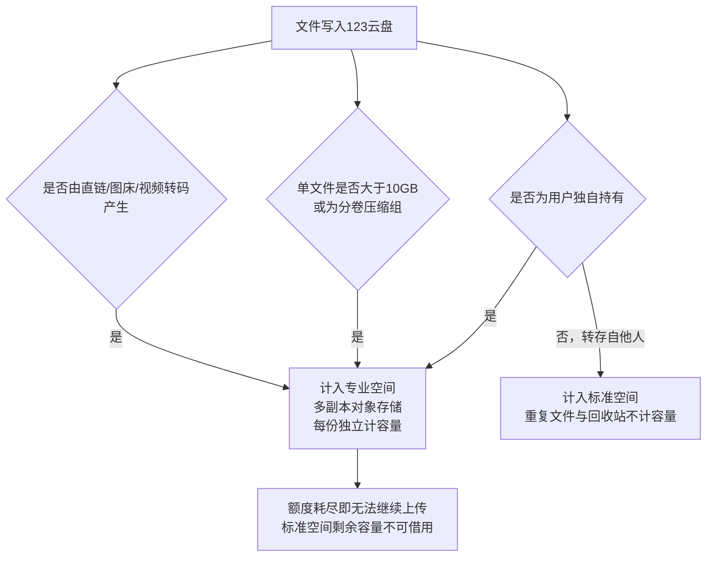
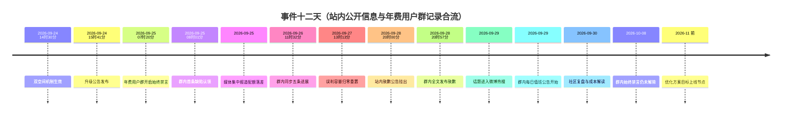
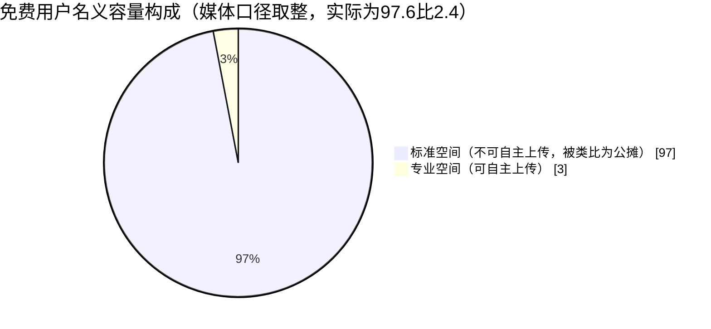
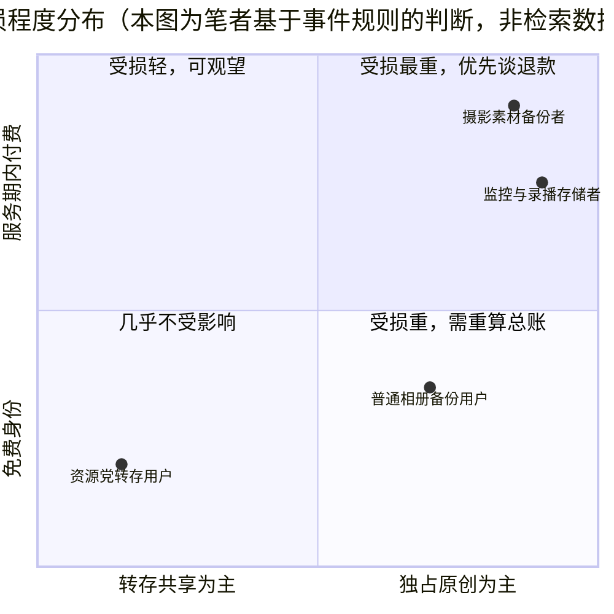

**报告日期：2026年10月8日** 由 Qwen3.8-Flash 撰写，内容并非 100% 准确

## 摘要

2026年9月24日14:30，123云盘把运行多年的单一存储空间拆成"标准空间"与"专业空间"两套互不通用的额度：标准空间承载靠去重技术支撑的转存文件，专业空间承载用户独自持有的文件、大于10GB的超大文件以及直链与图床产生的文件[donews.com](https://www.donews.com/news/1/6724009.html),[ZAKER新闻](https://www.myzaker.com/article/6ab74be58e9f0930da5ac851)。调整后用户能自主上传的额度只剩专业空间那一格：免费用户50GB，VIP 1TB，SVIP 2TB，长期VIP 3TB，这组数字在123云盘官方会员权益页上逐档列出（10月9日截图）[uc.cn](https://mparticle.uc.cn/article_org.html?uc_param_str=frdnsnpfvecpntnwprdssskt#!wm_cid=776502841050159104!!wm_id=1d2d859a7da24a0187a2256ca80b9f80)。舆论把这套规则压缩成一句"全球首创有公摊的网盘"，媒体按50GB与2TB的配置算出97%的"公摊比例"并广泛转载[weibo.cn](https://m.weibo.cn/detail/5348416278495832?wm=90194_90009),[搜狐](https://www.sohu.com/a/1082873644_184641)。官方在9月28日承认上线节奏、产品设计、规则说明、存量权益衔接四项不足，给出五条优化方向并支持退款，但明确保留双空间制度[凤凰网](https://i.ifeng.com/c/8woLLQzD9gx)；一篇法律分析文章认为对服务期内的付费用户大概率构成违约，这一判断未经司法或监管认定[今日头条](https://m.toutiao.com/article/7691149615235695144/)。渠道覆盖上，B站、微博与大众媒体样本完整，百度贴吧的事件专项帖未被公开索引[百度贴吧](https://tieba.baidu.com/p/9332852980)；官方年费用户群的一手记录补上了另一块拼图——公告次日07:20管理员开启"始终禁言"，此后4天里以@全体成员单向同步修复进展，9月28日20:57在群内全文发布致歉，至文章撰写日10月8日仍未解禁。本报告的判断是：这次调整在商业逻辑上可解释，在产品程序上不合格——生效早于公告、历史文件未经告知被重新归类，才是用户不信任的来源，而非成本区分本身。

## 1. 公告本身：一次把"共享池"和"独占池"切开的空间重构

### 1.1 9月24日公告的规则实质

123云盘于2026年9月24日14:30起正式实施双空间机制，把运行多年的单一存储空间一分为二[donews.com](https://www.donews.com/news/1/6724009.html)。原空间更名为"标准空间"，沿用重复文件与回收站不计容量的机制，用于存放用户转存自他人的文件及其他非独占文件；新增的"专业空间"采用多副本分布式对象存储，用于存放用户独自存储的文件、大于10GB的超大文件、分卷压缩文件组，以及直链、图床、视频转码服务产生的文件，且相同专业文件每份独立计算容量[donews.com](https://www.donews.com/news/1/6724009.html),[ZAKER新闻](https://www.myzaker.com/article/6ab74be58e9f0930da5ac851)。

> [!IMPORTANT] 公告真正的变化不在"新增空间"，而在"额度不再通用"
> 拆分之前，用户看到的是一整块容量；拆分之后，同一块容量被划成两个互不通用的池子。规则上，只有专业空间能承载用户自己上传的文件，标准空间承载的是用户之间互相转存的文件[ZAKER新闻](https://www.myzaker.com/article/6ab74be58e9f0930da5ac851)。这意味着"我买了多少TB"这个问题，从9月24日起有了两个答案。

从成本结构看，这两块空间的造价完全不同：标准空间依托去重技术，同一份热门资源在服务器上只存一份物理数据，平台边际成本极低；专业空间是多副本对象存储，每一份都要真实占用物理硬盘，成本显著更高[凤凰网](https://i.ifeng.com/c/8woLLQzD9gx)。公告把"是否独占"作为分界线，本质上是用文件的物理成本重新给用户的额度定价。

新老用户以2026年9月24日14:30:00为界区分，此前注册的是老用户，此后注册的是新用户[uc.cn](https://mparticle.uc.cn/article_org.html?uc_param_str=frdnsnpfvecpntnwprdssskt#!wm_cid=776502841050159104!!wm_id=1d2d859a7da24a0187a2256ca80b9f80)。配额落地的实际结果如下表。

**表1：双空间机制下的用户配额对照（官方会员权益页与升级公告口径合并）**

| 用户类型 | 专业空间 | 标准空间 | 口径说明 |
| :--- | :--- | :--- | :--- |
| 老用户（免费） | 50GB | 2TB | 原有空间不因升级减少[ZAKER新闻](https://www.myzaker.com/article/6ab74be58e9f0930da5ac851) |
| 新免费未实名用户 | 50GB | 50GB | 注册基础权益[uc.cn](https://mparticle.uc.cn/article_org.html?uc_param_str=frdnsnpfvecpntnwprdssskt#!wm_cid=776502841050159104!!wm_id=1d2d859a7da24a0187a2256ca80b9f80) |
| 新免费已实名用户 | 50GB | 2TB | 完成实名认证后提升[uc.cn](https://mparticle.uc.cn/article_org.html?uc_param_str=frdnsnpfvecpntnwprdssskt#!wm_cid=776502841050159104!!wm_id=1d2d859a7da24a0187a2256ca80b9f80) |
| 新VIP已实名用户 | 1TB | 20TB | 基础空间叠加会员权益[uc.cn](https://mparticle.uc.cn/article_org.html?uc_param_str=frdnsnpfvecpntnwprdssskt#!wm_cid=776502841050159104!!wm_id=1d2d859a7da24a0187a2256ca80b9f80) |
| 新SVIP已实名用户 | 2TB | 100TB | 基础空间叠加会员权益[uc.cn](https://mparticle.uc.cn/article_org.html?uc_param_str=frdnsnpfvecpntnwprdssskt#!wm_cid=776502841050159104!!wm_id=1d2d859a7da24a0187a2256ca80b9f80) |
| 长期VIP已实名用户 | 3TB | 6PB+2TB | 基础空间叠加会员权益，与官方会员权益页一致 |
| 新VIP未实名用户 | 1TB | 18TB+50GB | 官方会员权益页（10月9日截图） |
| 新SVIP未实名用户 | 2TB | 98TB+50GB | 官方会员权益页（10月9日截图） |
| 长期VIP未实名用户 | 3TB | 6PB+50GB | 官方会员权益页（10月9日截图） |

官方会员权益页把容量分成两行：一行是按是否实名认证区分的主容量，一行是所有档位统一标注的专业空间额度（VIP 1TB、SVIP 2TB、长期VIP 3TB、免费用户 50GB）。这一页还列出三项会员共有的"成长容量 800GB/月、上限至 100TB"，免费用户该行为叉号；本页没有标注成长容量计入专业空间还是标准空间，需要以云盘空间页面显示为准。

:::folding{title="点开补充：配额表之外的三条细则"}

- 历史文件兼容处理：升级上线时账号内已存在的文件，无论原始来源或属性，统一归类为标准文件并计入标准空间，不占用专业空间配额；此后这些文件再次发生操作时，系统按新规则重新判断属性，重新分类后若对应空间超额，按该空间容量管理规则执行[凤凰网](https://i.ifeng.com/c/8woLLQzD9gx),[donews.com](https://www.donews.com/news/1/6724009.html)。
- 实名认证口径：老用户后续完成实名认证不重复增加标准空间，新用户首次实名后标准空间提升至2TB[uc.cn](https://mparticle.uc.cn/article_org.html?uc_param_str=frdnsnpfvecpntnwprdssskt#!wm_cid=776502841050159104!!wm_id=1d2d859a7da24a0187a2256ca80b9f80)。
- 快科技与腾讯网在9月25日转述的公告截图中还列出未实名新会员档位：新VIP未实名用户为专业空间1TB加标准空间18TB+50GB，新SVIP未实名用户为专业空间2TB加标准空间98TB+50GB；同批报道指出，标准空间对转存文件同样设有单文件10GB的上限。这批媒体转述的未实名额度，与10月9日官方会员权益页截图完全一致，可作交叉印证。

:::

### 1.2 从上线到致歉的十二天

事件的第一处程序性缺陷在于时间顺序。公告的发布时刻是2026年9月24日15:41，而双空间机制的生效时刻是同日14:30[donews.com](https://www.donews.com/news/1/6724009.html)——规则已经落地，公告随后才发出。多家媒体在梳理用户不满时指出，本次重大规则调整几乎没有提前公示和提醒，这成为舆论集中攻击的点。

> [!WARNING] 生效在前、公告在后
> 用户在9月24日下午打开云盘时看到的是已经改好的额度，而不是一份可供预留过渡期的预告。这一顺序问题，在后续致歉声明中被官方归入"上线节奏"与"规则说明"两项不足。

舆论发酵四天后，123云盘于9月28日发布《关于近期"专业空间"升级调整的说明与致歉》[凤凰网](https://i.ifeng.com/c/8woLLQzD9gx),[123云盘站内公告](https://www.123pan.com/Notice/?id=570152)。官方承认本次调整在上线节奏、产品设计、规则说明和存量权益衔接四方面存在不足，并提出五条优化方向：提高各等级用户赠送的专业空间容量并向老用户倾斜；优化空间归属规则，不再简单以文件大小区分；多人共有文件占用空间由各拥有人账户均摊；完善存量会员权益过渡方案；更清晰地展示规则变化[凤凰网](https://i.ifeng.com/c/8woLLQzD9gx)。优化方案力争在2026年11月前上线，对无法继续正常使用的用户支持按原支付渠道退还剩余服务期对应费用，同时官方强调不会因规则调整擅自删除用户正常存储的文件[凤凰网](https://i.ifeng.com/c/8woLLQzD9gx)。

致歉之后又追加了一次程序回滚。因升级后出现程序缺陷，部分历史文件被误判为专业文件，修复程序执行24小时未处理完毕，官方最终把所有用户的已用专业容量列入标准容量[腾讯网](https://view.inews.qq.com/k/20260929A089G000?openApp=false&web_channel=wap)。对首次报告该缺陷并帮助定位问题的用户，官方表示将予以感谢和奖励[凤凰网](https://i.ifeng.com/c/8woLLQzD9gx)。至9月28日，安卓客户端的更新说明中已把"新增专业空间"列为版本特性，用户可在文件列表中按所属空间筛选文件。

:::folding{title="这里值得留意的一点：致歉改的是'分法'，不是'分不开'"}

五条优化方向里，第2条与第3条直接回应争议核心——不再简单以文件大小区分归属、共有文件由拥有人均摊。但官方同时明确，双空间制度本身不会被取消，能接受调整的继续用，不能接受的老会员可申请退款[凤凰网](https://i.ifeng.com/c/8woLLQzD9gx)。换句话说，致歉修正的是分类规则的粗糙程度与告知方式，把"独占文件要单独计账"这一底层设计保留了下来。凤凰网与快科技在9月29日转载致歉声明全文时，同样把它概括为"优化空间规则并支持退款"，而非"撤回调整"。

:::

### 1.3 群内十二天：在禁言群里，用公告追修复

公开渠道看到的是公告与致歉，看不到的是官方年费用户群里的另一条时间线。这条线索上最重要的事实是顺序：9月27日13:13，管理员在群内已经宣布"已将所有被误判空间的用户的已用专业容量归零、所有被误判文件重置为标准文件，回归到历史文件状态"。公开致歉这边，站内公告页面标注的时间是9月28日20:00:55，这一时刻来自媒体转载所附的公告截图[acfun.cn](https://www.acfun.cn/a/ac48881070?_t=t)，群内以@全体成员同步全文是同日20:57。按这三组时间，实质性的回滚动作比致歉早了整整一天。

> [!NOTE] 本节材料口径
> 以下四条群内公告来自123云盘官方年费用户群的成员记录，含@全体成员原文。这类群内容不被搜索引擎公开索引，第三方无法独立核验；凡能与站内公告、媒体报道交叉印证的部分，文中另行注明可核验来源。引用原文时用引号标出，未加引号的是转述。

::::tabs{open}

:::tab{title="9月25日 07:20 与 08:01"}

- **07:20** 管理员开启"始终禁言"。此后直到文章撰写日10月8日，禁言未解除。
- **08:01** 群内首条@全体成员认领缺陷：文件所属空间计算逻辑"在特定情况下存在错误，导致部分用户的一些标准文件被误计入专业空间"，官方称"今天之内会修复该问题"，并承诺"我们修复后会重算容量"，对情绪给出"请稍安勿躁"的安抚。同一条公告还认领了两个待测问题：新上传且秒传的文件被计入专业空间、自己的10GB内专业文件被他人转存后未更新为标准文件。

:::

:::tab{title="9月26日 11:32 五条进展"}

- 空间计算逻辑错误已于前一日修正，但上线至修正期间被误判的文件需重新判定，凌晨开始执行判定程序，"由于文件量较大，预计还要再等几个小时"，且此时"部分用户的容量仍然是不准的"。
- **专业空间超额无法下载网盘内文件的逻辑已调整，现在允许大家下回自己网盘内的文件**——这是本轮争议里一次明确的权益回退：此前专业空间超额会连带锁死用户取回自有文件。
- 对历史文件的下载、在线播放、预览、查看详情不再触发空间判定，这几个操作不会导致文件从标准空间进入专业空间。
- 10GB内专业文件被他人转存后未更新为标准文件：官方称"测试过了，逻辑是对的"，但存在计算延迟，建议隔日再查，超24小时未更新可联系群内技术支持。
- 10GB以上大文件计入专业空间的问题"后续会有更好方案，争取在平台成本与用户合理需求之间找到平衡"。

:::

:::tab{title="9月27日 13:13 归零重置与五条答疑"}

修复策略在这天换了路线：昨天尝试修复误判文件并重算容量，"由于数据量太大，修复程序执行了24小时仍未处理完毕"，于是改为把被误判用户的已用专业容量归零、把被误判文件重置为标准文件。同日群内答疑给出五条规则说明：

1. 新增文件（上传、转存、离线下载）默认先进标准空间，后台异步判定归属，属专业的改为蓝色专业文件标识，高负载下状态刷新可能延迟。
2. 标准空间的重复文件不计容量与回收站不计容量规则仍然有效，但数据量大时容量扣减存在延迟，"过几天我们会上线手动刷新容量功能"。
3. 转存时同时对专业空间与标准空间可用容量做双重判定，任一空间可用容量小于对应总大小即转存失败。
4. 规则中的"转码文件"仅指开发者工具"视频转码"服务产生的文件，网盘内播放视频产生的自动转码不算，"播放视频不会多占用任何容量"。
5. 专业空间与过去的网盘空间不同：旧空间禁止商用、禁止存储监控/直播/日志/视频切片类内容，而专业空间对标商业云对象存储，允许商用与各类专业用途、不限内容类型、采用两地三副本冗余存储，后续将上线S3协议及更多对象存储功能。

:::

:::tab{title="9月28日 20:57 与 9月29日起"}

- **20:57** 管理员把《关于近期"专业空间"升级调整的说明与致歉》全文贴入群内，内容与站内公告一致：承认上线节奏、产品设计、规则说明、存量权益衔接四项不足，给出五条优化方向，力争2026年11月前上线，支持退款登记，承诺不因规则调整擅自删除用户正常存储的文件[凤凰网](https://i.ifeng.com/c/8woLLQzD9gx)。这份声明在群内的传播方式仍是@全体成员+禁言。
- **9月29日起** 管理员每天发布一条"@全体成员 今天技术支持值班人员@xxx，大家有业务问题可以私聊咨询"，同日大量VIP用户进群。群的功能由此定型：公开讨论关闭，问题处理转入私聊一对一。

:::

::::

**表2：群内公告动作与规则含义（材料为年费用户群记录）**

| 群内时间 | 公告动作 | 对用户的规则含义 |
| :--- | :--- | :--- |
| 9月25日 07:20 | 开启始终禁言 | 群内公开讨论通道关闭 |
| 9月25日 08:01 | 认领空间计算逻辑错误 | 误判定性为缺陷，承诺当日修复并重算容量 |
| 9月26日 11:32 | 放开超额禁下载 | 专业空间超额不再锁死自有文件的下载权 |
| 9月26日 11:32 | 四种查看操作不再触发判定 | 播放、预览不再会把标准文件推入专业空间 |
| 9月27日 13:13 | 已用专业容量归零、误判文件重置 | 放弃精算路径，回滚到历史文件状态 |
| 9月27日 13:13 | 转存做双空间容量双重判定 | 任一空间不足即转存失败 |
| 9月28日 20:57 | 致歉声明全文入群 | 制度保留，承诺11月前优化并开放退款 |
| 9月29日起 | 每日值班人员公告，大量VIP进群 | 沟通改为私聊，群转为单向公告牌 |

这四天里能读出的，不只是修复速度，还有决策路径的变化。9月25日08:01的说法是"今天之内修复、修复后重算容量"，9月26日11:32改口为"判定程序仍在跑、容量还不准"，到9月27日13:13直接换成归零重置——从精确重算退到整体回滚，官方给出的理由是数据量太大、24小时跑不完。这与站内公告只说"核心问题已基本恢复"的口径相比，群内记录要诚实得多，也更能说明这次升级的工程准备程度：判定逻辑与异步任务的处理能力，撑不住一次全量用户的历史文件重算。

:::folding{title="点开看：9月27日第5条答疑为什么值得单独说"}

前四条答疑都是把已有规则讲清楚，第5条是官方第一次正面给专业空间做价值陈述：旧网盘空间本来就禁止商用、禁止监控/直播/日志/视频切片类内容，用户"以往只能偷偷商用和存储"，既有资源浪费也有账号被风控、数据取不回的自身风险；专业空间对标商业云对象存储，允许商用与各类专业用途、不限内容类型、采用两地三副本冗余存储，后续还要上线S3协议与对象存储专属功能。

这段表述解释了"专业空间"这个名字的来历，也暴露了争议的结构性难点：平台端把它当成一次把灰色需求合规化、并向对象存储靠拢的产品升级；用户端看到的是自己原有额度被切走、且切走的部分要另付钱。同一条规则，一侧叙述为新增能力，一侧体验为权益缩减，公开渠道里几乎没有第三种说法。

:::

## 2. 大众导向：情绪如何凝聚成"公摊网盘"这一个词

### 2.1 标签的传播路径与杀伤力

"全球首创有公摊的网盘"是本次事件中传播效率最高的一句话，用户在吐槽时给123云盘贴上了这个标签[weibo.cn](https://m.weibo.cn/detail/5348416278495832?wm=90194_90009)。它之所以能迅速跑开，靠的是一次跨领域类比：住房公摊是被广泛熟悉且长期被抱怨的制度，把"标准空间不计入自主上传"翻译成了"买房面积里有97%是公摊"。

> [!QUOTE] 传播链条
> 微博话题以"#123云盘被吐槽全球首创有公摊网盘#"与"#123云盘公开道歉#"双标签形式在9月29日聚合发布；搜狐、网易、快科技、今日头条、百家号、AcFun、UC头条、什么值得买在9月25日至10月3日间接力同一表述，AcFun弹幕视频网也转载了"网友吐槽全球首创有公摊网盘"的相关内容[acfun.cn](https://www.acfun.cn/a/ac48881070?_t=t)。

媒体在计算这个类比时给出了具体比例：按免费用户50GB专业空间加2TB标准空间，可自主上传的部分是 50GB ÷ (50GB + 2048GB)，约2.4%，报道据此把剩下的97.6%称作公摊，流传中的97%是取整后的数字[搜狐](https://www.sohu.com/a/1082873644_184641)。这一数字的杀伤力来自反差：同一篇报道把住房公摊拿来对照，称其比例往往在20%左右，而网盘给出的公摊接近其五倍。需要说明，20%是该文的类比口径，不是本次调研统计的房产数据，两者可比之处只有一项——名义面积与实际可用面积之间的差额。

标签的负面效果不止于比价。大众媒体普遍把本次事件解读为网盘行业在存储成本压力下主动"赶客"，有评论直言这次调整的本质是"借机收回免费用户手里的存储空间"，甚至被理解为"免费用户请自觉卸载"[搜狐](https://www.sohu.com/a/1082873644_184641)。从"公摊"到"赶客"，舆论完成了一次从产品规则到经营诚意的定性升级：用户不再讨论容量本身，而是讨论平台是否还想服务免费用户。

### 2.2 分渠道观察：B站、贴吧、QQ频道与其他社区

::::tabs

:::tab{title="B站：拆解规则与动员维权"}

B站长文动态《123云盘这次，踩雷区了》把新旧配额落差逐条摊开：新免费用户可自行上传的空间从2TB缩减至50GB，新SVIP用户从102TB缩减至2TB，并给出结论"不管是对老用户还是新用户，均是不利的"[网易](https://m.163.com/dy/article/L82ITOUJ0531BB1N.html)。文中有会员晒出专业空间仅剩1TB的截图，也有用户提出不能简单退款了事，因为迁移所花的时间成本无法计算[网易](https://m.163.com/dy/article/L82ITOUJ0531BB1N.html)。

视频区的情绪更直接：有UP主发布题为"现在的123云盘【2025年9月起】"的内容，以及"严肃谴责123云盘违约""避雷这个网站"一类视频，反映的是对规则变更的正面拒绝[哔哩哔哩](https://www.bilibili.com/video/BV1jA4KzfEpH/)。

:::

:::tab{title="百度贴吧：长期不满的沉淀池"}

经过多轮精准搜索（含"123云盘吧 专业空间 吐槽"、"123云盘吧 公摊 9月"、"123云盘吧 双空间 搬家"以及 site:tieba.baidu.com 定向检索），百度贴吧"123云盘吧"关于9月24日双空间事件的专项讨论帖未被搜索引擎公开索引。可检索到的贴吧内容呈现的是长期积累的不满：在"各位免费用户开始准备搬家吧"一帖中，有用户评论"开了三年会员的我都不用了，何况免费的，简直狗屎一般，体验极差，早点换115吧"；另有用户指出"这个盘刚公测了四年，就由当初宣称的永不限速改成了现在这个德性，彻底堵死了非会员的路"[百度贴吧](https://tieba.baidu.com/p/10270118510)。资源社区相关帖子里还能看到"离线成功率太低""同步有bug"这类功能性抱怨[百度贴吧](https://tieba.baidu.com/p/9371711126)。

:::

:::tab{title="QQ群：靠一手记录补上的那块拼图"}

这一渠道公开检索仍然是空白：多轮检索（含"123云盘 QQ频道 专业空间 讨论"、"123云盘 官方QQ群 9月24日 双空间"）都找不到事件相关的群内原始内容，仅能确认123云盘资源社区网站置顶帖中提及存在"123社区qq群组、tg频道&群组"[百度贴吧](https://tieba.baidu.com/p/9332852980)。也就是说，任何写这篇文章的人都没有条件凭检索还原群内舆论。

本篇用的是另一条路：由群成员提供的官方年费用户群@全体成员公告原文（详见1.3节）。这些材料能直接证明三件事——群在9月25日07:20被开启始终禁言、修复进展以每日公告单向同步、9月28日20:57致歉全文入群。它们能还原官方一侧的动作序列，却还原不了用户一侧的发言内容，因为禁言之后的群消息本身就不存在。因此对QQ群，可靠结论只有一句：付费用户群内的声音没有留下可查记录，留下的痕迹是管理员的回应节奏与关闭讨论这个动作本身。

:::

:::tab{title="其他社区：换盘与止损"}

卡饭论坛IT资讯区转载相关新闻后，用户"风屿法师"留言"刚把我的旧版安装包合集放到123盘上面去分发，早知道不碰它了"，用户"DeepFormat"回复"我换天翼了"，用户"hardkin"评论"之前可以直接浏览器下载的，现在都要转存入自己网盘才能使用浏览器下载""123在逐渐向全面收费过渡"[kafan.cn](https://bbs.kafan.cn/thread-2295792-1-1.html)。

:::

::::

**表3：各渠道信息可得性（截至2026年10月8日，检索结果与群内一手记录合并）**

| 渠道 | 覆盖状态 | 关键发现 |
| :--- | :--- | :--- |
| 官方公告与致歉 | 完整 | 双空间规则、五条优化方向、退款政策、程序回滚说明[凤凰网](https://i.ifeng.com/c/8woLLQzD9gx) |
| B站 | 完整 | 长文拆解落差、UP主谴责违约、平台历史上曾点名维权[网易](https://m.163.com/dy/article/L82ITOUJ0531BB1N.html) |
| 大众媒体与微博 | 完整 | "公摊"标签、97%比例、违约分析、行业成本解读[weibo.cn](https://m.weibo.cn/detail/5348416278495832?wm=90194_90009) |
| 卡饭论坛 / AcFun | 完整 | 用户表达换盘意向，媒体转载"公摊网盘"吐槽[kafan.cn](https://bbs.kafan.cn/thread-2295792-1-1.html) |
| 百度贴吧 | 部分缺失 | 事件专项帖未被索引，仅可检索到长期不满与搬家讨论[百度贴吧](https://tieba.baidu.com/p/9371711126) |
| QQ频道 | 未覆盖 | 仅确认存在官方社群入口，事件相关讨论未被公开索引[百度贴吧](https://tieba.baidu.com/p/9332852980) |
| 官方年费用户群 | 一手记录，不可公开核验 | 9月25日07:20起始终禁言、四天逐条修复公告、9月28日20:57致歉全文入群、9月29日起每日值班公告，材料由群成员提供 |

:::folding{title="补充观察：检索不到的渠道，怎么处理才诚实"}

渠道缺口要写进结论，而不是藏进脚注。本篇的证据因此分成三档：第一档是可公开检索、第三方可复核的站内公告、媒体报道、B站内容、微博话题与卡饭论坛回帖；第二档是群成员提供的一手记录，能还原官方一侧的动作序列但无法独立核验；第三档是彻底的空白，即百度贴吧的事件专项帖与QQ频道内部讨论，它们不出现不代表情绪温和，只代表内容不进索引。评估大众导向时，负面强度可以从第一档的四处一致外推为"公开舆论场几乎一致反对"；把第二档的禁言事实读成"群内一片声讨"则超出证据范围——我们只知道讨论被关闭，不知道被关闭前说了什么；把任何一档外推为"所有用户都在搬家"同样没有依据。

:::

### 2.3 禁言：大众导向的最后一环是渠道处置

群内记录补上了舆论研究里最难拿到的那类证据：平台怎么处理它不愿接受的反馈。按群成员提供的记录，9月24日公告发布后官方年费用户群内出现大量不满，9月25日07:20管理员把群设为始终禁言，到文章撰写日的10月8日仍未解除。

- **2026年9月25日07:20**，对象换成自家年费会员，手段换成关闭发言权；同一时段，官方仍在群里逐条修bug、逐条答疑。
- **2026年9月29日起**，群内改为每天播报值班人员，"大家有业务问题可以私聊咨询"，同日大量VIP用户进群。问题处理路径由公开讨论改为一对一私聊。

> [!DANGER] 修bug与关讨论是同时发生的
> 单看公告内容，这四天的官方动作是负责任的技术响应：认领缺陷、放开超额禁下载、取消查看操作触发判定、误判容量归零重置、致歉并开放退款。单看群设置，同一批动作发生在一只始终禁言的群里。两者合起来才是完整图景——问题在解决，表达在关闭，而被关闭的表达并没有消失，它转移到了B站、微博话题、贴吧与各类论坛。公开渠道里负面声量的集中爆发，与付费群内禁言的时间点是重合的。

这也让"公摊"标签的传播条件变得可解释：当最该发声的一群人（付费额度受损最重的年费会员）在自己的群里说不出话，舆论的载体就只能由站外媒体与内容平台承担。于是最终呈现的大众导向，是一个几乎只剩批评的公开场——不是因为温和的意见不存在，而是持重心的用户没有公开表达的位置。

:::folding{title="这一节能推到哪一步，推不到哪一步"}

可以推到的：平台在争议期内的沟通策略是"单向公告+关闭发言"，这一点有群内时间与公告原文支撑，且与致歉声明第五部分承诺的"完善重大规则调整前的用户沟通和灰度验证机制"[凤凰网](https://i.ifeng.com/c/8woLLQzD9gx)形成对照——承诺指向的是调整前的沟通，实际动作是调整后的禁言。

推不到的：群内用户的具体发言内容、禁言决定的作出人、群内是否有过短暂开放。这些都没有留下可查记录，任何"群内骂声一片"或"群内多数用户接受解释"的说法都不该写进这篇文章。

:::

## 3. 争议底层：权益账、成本账与合规账

### 3.1 付费老用户的权益缩水与违约争议

用户真正被削减的不是容量数字，而是容量的用途。"对仍在服务期内的付费用户大概率构成违约"这句判断，出自一篇今日头条的分析文章，作者援引民法典格式条款原则：平台协议里"有权调整规则"的条款不能用来单方面削减用户已经付费购买的核心服务权益，用户买的是完整存储空间，平台私自拆分并限制使用属于实质性减损权益，道歉与退款都是事后补救，不代表当初行为合法合规[今日头条](https://m.toutiao.com/article/7691149615235695144/)。需要分清的是，这是媒体评论文章里的法律分析，本轮检索没有看到法院判决、监管定性或公开的立案信息，把这句判断当作已生效的结论会超出证据。用户能确认的事实只有一条：付费时买到的额度，用途变了。

落差的具体量级可以从自主上传容量的变化读出。

退款为什么不足以平息争议，B站长文里那条评论给出了答案：多年会员的钱已经交了，文件也已经搬进来了，现在使用条件变了，即便能退款，整理和迁移花掉的时间也无法计算[网易](https://m.163.com/dy/article/L82ITOUJ0531BB1N.html)。这是一种典型的"沉没成本加迁移成本"结构——退给用户的只是剩余服务期的对价，用户付出的却是把数十TB文件重新分类、下载、再上传另一块盘的劳动与时间。[^migrate]

[^migrate]: 迁移成本在本次事件中并非抽象担忧。致歉声明提到，因程序缺陷导致部分历史文件被误判为专业文件，修复程序执行24小时未处理完毕，官方最终将被误判用户的已用专业容量重置为标准文件[腾讯网](https://view.inews.qq.com/k/20260929A089G000?openApp=false&web_channel=wap)；规则本身还要求历史文件在再次发生操作时按新规则重新判断属性[donews.com](https://www.donews.com/news/1/6724009.html)，这意味着用户需要反复核对文件归属。

> [!FAILURE] 用户不满的层次结构
> 检索到的反馈可以分成三层：较浅的一层是"额度不够用"，对应的是50GB专业空间与个人备份需求之间的缺口[uc.cn](https://mparticle.uc.cn/article_org.html?uc_param_str=frdnsnpfvecpntnwprdssskt#!wm_cid=776502841050159104!!wm_id=1d2d859a7da24a0187a2256ca80b9f80)；中间一层是"事先没告诉我"，对应的是生效在前、公告在后的顺序问题；较深的一层是"我不再相信这个规则会稳定"，它来自此前多轮权益收紧的累积，单靠一次退款无法修复。

### 3.2 平台的成本账与行业背景

平台的解释有事实基础。123云盘在致歉声明中把调整动因归为三项：AIGC与短视频等内容快速增长，独有文件、多版本文件与个性化文件不断增多，文件去重效率下降；存储硬件、带宽、机房和运维成本持续上升，网盘服务的长期运营压力增加；部分用户存在商业视频素材、直播录屏、监控录像这类共有率极低的存储需求，与面向个人日常存储和分享设计的标准空间存在差异[凤凰网](https://i.ifeng.com/c/8woLLQzD9gx)。大众媒体在复盘时同样把存储芯片暴涨与运营商跨网流量结算成本上升，认定为123云盘调整的根本动因[搜狐](https://www.sohu.com/a/1082873644_184641)。

:::folding{title="点开看：123云盘成本传导的两年时间线（媒体公开报道口径）"}

- 2025年11月26日：发布免费用户权益调整通知，免费提取流量由PC与网页端单日累计上限1GB，调整为全端单月累计上限10GB；在线播放音视频计入流量；取消游客下载100MB以内文件的免费权益。官方称打击对象是批量注册、破解接口、盗链建站的"羊毛党"，并用"不是撑不住，是守得住"作为说明标题。
- 2025年12月12日：发布部分商品价格调整通知，理由是三网运营商实施跨网流量省间结算、跨网跨省流量结算成本显著上升，服务器硬盘与内存采购维护成本出现数倍增长，自2026年1月1日0时起调价。
- 2026年5月31日：发布沉默用户服务冻结通知，连续一年以上未登录的免费账号数据转入冷存并冻结30天，逾期未激活将被清理，付费会员不受影响。
- 2026年6月4日：开通"账号使用权过户"官方服务，过户服务费按合同成交价的20%计收、最低100元。
- 2026年8月：博主"6GHz"公开称花2999元购买5年期1PB空间加会员，仅上传18TB摄影素材即以触发风控为由被停用账号，客服要求加钱升级商用版，当事人向市场监管部门投诉并获受理；同容量方案此后报价降至2699元10年。
- 2026年9月21日：集邦咨询判断云端需求走强、企业级SSD第四季度价格预计继续上涨，B站长文引用该判断作为行业成本压力的佐证[网易](https://m.163.com/dy/article/L82ITOUJ0531BB1N.html)。
- 2026年9月24日：双空间机制生效[donews.com](https://www.donews.com/news/1/6724009.html)。

:::

把这条时间线排开之后，9月24日的调整就不再是孤立动作，而是一套连续的成本回收路径：先收流量、再涨价、再清沉默账号、再把独占文件单独计账。什么值得买在9月29日的复盘里给了一种更直白的读法——免费容量与促销容量一直是获客补贴，补贴退坡时规则必然被重新定义，"公摊"是给过去的超售补课：卖出去的容量从来是按转存热度复用的物理空间，现在干脆把复用部分明码标出。

> [!NOTE] 两条账不能互相抵
> 成本上升解释的是"为什么要改"，不解释"为什么可以不打招呼就改"。存储芯片涨价是行业共同面对的约束，同期各家网盘的处理方式并不相同；把成本压力直接等同于调整程序的正当性，是平台侧叙事里最容易滑过去的一步。

### 3.3 用户视角的重算：这些规则落到你的文件上是什么后果

前面几节讲的是平台的账。换成用户的位置，双空间真正改变的是四件事：自己的文件和别人转存的文件不再共用一份额度；单文件超过10GB就落入更贵的池子；文件是否"只有你持有"会动态改变归属；转存时要同时通过两块空间的容量判定。把这四件事摊到常见文件上，结果如下。

**表5：常见文件在双空间规则下的归属与用户后果**

| 你的文件类型 | 落在哪块空间 | 判定依据 | 用户后果 |
| :--- | :--- | :--- | :--- |
| 手机相册原画质备份 | 专业空间 | 用户独自存储的文件计入专业空间[donews.com](https://www.donews.com/news/1/6724009.html) | 免费档50GB，开通会员也只有1TB到3TB，备份需求大的账号会先撑不住 |
| 相机原片、剪辑工程、加密备份 | 专业空间 | 独占文件与大于10GB的超大文件都计入专业空间[donews.com](https://www.donews.com/news/1/6724009.html) | 单个大文件就可能吃掉大半额度，标准空间剩多少都帮不上 |
| 热门影视、软件安装包这类转存资源 | 标准空间 | 转存自他人的文件计入标准空间，重复文件不计容量[ZAKER新闻](https://www.myzaker.com/article/6ab74be58e9f0930da5ac851) | 这类用法几乎不受影响 |
| 直链、图床、开发者工具视频转码产生的文件 | 专业空间 | 公告把这三类功能产生的文件划入专业空间[donews.com](https://www.donews.com/news/1/6724009.html)；9月27日群内答疑补充，网盘内播放视频的自动转码不算，播放不多占容量（一手记录） | 做图床、挂直链的人成本模型被改写；普通在线看片不受这一条影响 |
| 监控录像、直播录屏、商用素材 | 专业空间 | 致歉声明把这类共有率极低的需求单列为调整动因[凤凰网](https://i.ifeng.com/c/8woLLQzD9gx)；9月27日群内答疑称专业空间允许商用、采用两地三副本冗余（一手记录） | 原本违反旧规则、有被风控风险的用途，现在有了明码标价的合规通道 |
| 回收站文件与重复文件 | 不占容量 | 标准空间沿用重复文件与回收站文件不计容量的机制[ZAKER新闻](https://www.myzaker.com/article/6ab74be58e9f0930da5ac851) | 这条老福利没有被取消，仍是123云盘相对同行的省容量设计 |

表里最容易被低估的一行是"转存双重判定"。按9月27日的群内说明，转存时专业空间与标准空间的可用容量会同时校验，任一块不够就转存失败（一手记录）。这意味着一个标准空间还剩几十TB、专业空间已经满的账号，转存大文件照样会被拒。同类问题在9月26日有过一次权益回退：此前专业空间超额会连带锁死自有文件的下载，调整后允许用户把自己的文件下回去（一手记录）。

用户的实际反馈已经走到投诉渠道。黑猫投诉平台上一条9月25日提交的投诉以"123云盘会员空间被拆分，核心权益缩减要求退款答复"为题，诉求写明要求就未在APP显著弹窗告知给予正式答复，并退还账号剩余权益，投诉人称已联系客服未获合理解决[黑猫投诉](https://sx.tousu.sina.cn/complaint/view/17401851582/?sld=00ff7892f475b61805d3f9ac3d88a44c)。同一时间窗口里，一篇10月7日的免费网盘横评把123云盘写进"改规则翻车，谨慎上车"，提到评论区出现退款潮与下载限速的说法，给出的建议是观望、别急着充钱[网易](https://m.163.com/dy/article/L8LA8790055616YL.html)。该横评属自媒体对比稿，文中对阿里云盘、夸克网盘的容量与速度描述本轮未逐一核验，只作为用户端情绪的旁证引用。

把同行怎么处理规则调整摆在一起看，判断会更清楚。迅雷在2026年4月16日通知，连续一年未登录的非会员用户初始免费空间在2027年4月16日之后调整为10GB，超出部分的文件不删除，只保留下载和访问、不能再存新文件[网易](https://www.163.com/dy/article/KULI4VP505119K9O.html)。百度网盘的做法是超365天未登录把2TB降为100GB且不可恢复，文件仍在，想存新的要扩容。阿里云盘与夸克网盘走账户冻结，冻结前会经短信、邮件提醒。123云盘在2026年5月31日的沉默用户通知里同样给了缓冲期，连续一年未登录转冷存冻结30天，但逾期之后数据被清理，付费会员在有效期内不受影响[IT之家](https://www.ithome.com/0/957/721.htm)。同样是降本，几家的差别集中在两点：动不动用户的存量数据，以及告不告诉用户。

:spoiler[用户在意的其实不是平台要不要降本，而是降本会不会动到我的数据和已经付过的钱，以及动手之前有没有人先说一声。]

## 4. 我的判断：这件事应该怎么读，用户该怎么办

### 4.1 对公告与舆论双方的评估

就公告本身，我的判断分两层。商业逻辑层，这次调整站得住：去重技术决定的"共享文件近乎免费、独占文件全额占用物理盘"这一成本结构是客观事实，把两类文件分账管理，方向上与行业通行做法一致[凤凰网](https://i.ifeng.com/c/8woLLQzD9gx)。产品程序层，这次调整站不住：生效时刻早于公告时刻、历史文件在用户不知情的情况下被重新归类、以文件大小作为一刀切的判定标尺，这三点合起来构成的是程序上的不合格，官方在9月28日的致歉里承认的四项不足也正是这四项[凤凰网](https://i.ifeng.com/c/8woLLQzD9gx)。用一句更直白的话概括：把"独占文件要单独算账"这件事做成制度，是可以的；把它做成用户醒来才发现自己已经住进公摊房，是不可以的。

就舆论，"公摊"标签精准但过于简化，它把合理的成本区分与不合理的告知方式一并否定掉了。97%这个数字在传播上是有效的，在技术上却偷换了单位——它比较的是"名义面积"与"可使用面积"，而标准空间本来就是被去重技术支持的共享池，用户过去实际也在共用它，并不是新出现的公摊。真正值得追问的不是"公摊比例多高"，而是下一次规则变更用户能否提前知道。UC头条在9月30日的评论里把这点写得很清楚："我关心的不是道歉，是下一次改规则谁先知道"。这类反思比单纯的情绪声讨更有推动力，因为它指向可验证的机制改动，而不是要求平台撤销一项成本上必要的制度。

把群内记录补进来之后，我的判断还要往下压一层：这次事件暴露的核心问题不是容量设计，而是沟通权力的不对称。误判容量归零重置发生在9月27日13:13，公开致歉在9月28日20:00挂出、20:57入群——官方内部对问题性质的判断比对外表述更早也更具体；致歉声明写"责任在我们"，同一只群从9月25日07:20起一直保持始终禁言。承认错误的文字和接受意见的姿态，没有对齐。这一段判断的前提是群内记录与原文一致，那份记录无法公开核验，若与实际情况有出入，推论要一并作废。反过来看9月26日那三条修正——超额不再锁死自有文件下载、播放预览不再触发空间判定、判定逻辑错误前一日已修——它们都不是制度层面的让步，只是把规则的不合理后果削掉，用户立刻能感到差别。这说明可谈的空间一直存在，只是入口由平台单方开关。

:spoiler[把话说到底：这是一次把"信息不对称红利"公开化的定价改革，只是选错了执行顺序。]

### 4.2 给不同用户的选择建议与观察指标

判断去留的依据应当是个人的文件构成，而不是舆论声量。

- **以转存他人分享为主的免费用户**：标准空间的机制没有变化，重复文件与回收站依旧不计容量，实际体验的变动有限[ZAKER新闻](https://www.myzaker.com/article/6ab74be58e9f0930da5ac851)。真正影响这类用户的是流量侧的收紧，与双空间属于两条线。
- **以相机原片、加密备份、商用素材为主的付费用户**：这是受损最重的一群。自有文件几乎必然落入专业空间，官方会员权益页上三档会员的专业空间分别是 VIP 1TB、SVIP 2TB、长期VIP 3TB，免费用户 50GB（10月9日截图）[uc.cn](https://mparticle.uc.cn/article_org.html?uc_param_str=frdnsnpfvecpntnwprdssskt#!wm_cid=776502841050159104!!wm_id=1d2d859a7da24a0187a2256ca80b9f80)。这类用户即使标准空间剩余几十TB，专业空间耗尽即无法继续上传。
- **把123云盘当WebDAV与直链源的用户**：直链、图床、视频转码服务产生的文件全部计入专业空间，且相同专业文件每份独立计算容量[donews.com](https://www.donews.com/news/1/6724009.html)。这类用法的成本模型被规则直接改写，属于必须重算的一类。

眼下有四件事值得做，和最终留不留无关。

- [ ] 打开云盘空间页，把专业空间的已用与总额抄下来，与官方会员权益页的额度对照，页面截图保留时间戳
- [ ] 数一下自己的文件里有多少个超过10GB、有多少属于只有自己持有的独占文件，这两个数字决定专业空间够不够用
- [ ] 重要数据在本地或另一块盘留一份副本。误判回滚与沉默账号清理这两件事都说明，单一云盘不该是唯一副本
- [ ] 需要退款的走在线客服登记，备好订单信息和剩余权益截图；公开投诉平台上已经有以未在APP显著弹窗告知为诉求的记录，协商不顺时这是一条备选路径

对还在观望的用户，我建议盯四项验证指标，不必被每日的舆论噪音推着做决定：

- [ ] 年费用户群的"始终禁言"是否解除。这是最容易观察的先导指标，比任何容量数字都更早说明沟通机制是否真的变了
- [ ] 专业空间赠送容量是否真的提高，且对老用户的倾斜有明确数字，而不是"适当倾斜"这类表述
- [ ] 空间归属规则是否取消文件大小这条标尺，直链与图床场景是否被单独豁免
- [ ] 重大规则调整前是否建立了提前公示与灰度验证机制，官方在致歉里承诺"完善重大规则调整前的用户沟通和灰度验证机制"[凤凰网](https://i.ifeng.com/c/8woLLQzD9gx)

这四项在2026年11月前落地，则本次事件可视为一次被舆论修正的产品事故；若落地内容仍停留在容量数字的微调，则用户需要接受一个新的基本前提：在123云盘里，名义容量与可用容量是两件事，任何后续文件都应按这一前提估值。退款窗口按原支付渠道退还剩余服务期对应费用，是当下唯一可以立刻执行的止损手段[凤凰网](https://i.ifeng.com/c/8woLLQzD9gx)。

## 核心参考文献

[全球首创网盘公摊，123云盘突然开始“赶客”_用户_文件_空间](https://www.sohu.com/a/1082873644_184641)

[123云盘调整空间规则后引发用户不满，官方致歉并披露优化方向_凤凰网](https://i.ifeng.com/c/8woLLQzD9gx)

[123云盘新增专业空间:原空间更名为标准空间,老用户免费配额为 50GB+2TB](https://mparticle.uc.cn/article_org.html?uc_param_str=frdnsnpfvecpntnwprdssskt#!wm_cid=776502841050159104!!wm_id=1d2d859a7da24a0187a2256ca80b9f80)

[【#123云盘被吐槽全球首创有公摊网盘#】#123云盘公开道歉#9月29日消息，日前，123云盘对存储空间体系进行调整，将原有空间更名为“标准空间”，同时新增“专业空间”，用于分类管理不同类型文件。按照新规则，无论是用户自行上传还是转存文件，只要单个文件超过10GB，就会占用专业空间；10GB以下文件则计入标准空间。这一调整很快引发大量用户不满，有网友甚至吐槽其为“全球首创有公摊的网盘”。对此，123云盘日前发布公告，就专业空间调整进行说明并公开道歉。123云盘表示，在认真查看用户反馈、批评和建议后，公司意识到此次调整在上线节奏、产品设计、规则说明以及存量权益衔接等方面存在不足，并向受到影响的用户致歉。针对用户集中反馈的问题，123云盘已经形成初步优化方案，主要包括以下几个方向：1、提高各等级用户赠送的专业空间容量，并对老用户给予适当倾斜；2、优化空间归属规则，不再简单以文件大小区分文件所属空间；3、多人共有文件占用的存储空间，由各拥有人账户均摊分担；4、完善存量会员权益过渡方案，确保用户已购买的服务在有效期内得到合理保障;5、更清晰地展示空间占用、规则变化和文件管理方式，减少用户理解成本。123云盘表示，由于产品调研、设计策划等需要一定时间，相关优化方案力争在2026年11月前正式上线。对于因本次调整无法继续正常使用服务的用户，123云盘也明确支持退款。用户可联系在线客服登记，平台在核实订单信息及剩余权益后，将按照原支付渠道退还剩余服务期对应费用。此外，123云盘强调，除法律法规另有规定，或用户违反服务协议等情况外，不会因为此次规则调整擅自删除用户正常存储的文件，](https://m.weibo.cn/detail/5348416278495832?wm=90194_90009)

[123 云盘私自改存储规则惹众怒后致歉！对付费用户是否构成违约 - 今日头条](https://www.toutiao.com/article/7691149615235695144/)

[123云盘私自改存储规则惹众怒后致歉！对付费用户是否构成违约](https://m.toutiao.com/article/7691149615235695144/)

[123云盘9月24日上线双空间机制：标准空间与专业空间](https://www.donews.com/news/1/6724009.html)

[123云盘这次，踩雷区了](https://m.163.com/dy/article/L82ITOUJ0531BB1N.html)

[123云盘这次，踩雷区了 - 哔哩哔哩](https://www.bilibili.com/opus/1253671915455774738)

[各位免费用户开始准备搬家吧【123云盘吧】_百度贴吧](https://tieba.baidu.com/p/10270118510)

[123云盘调整空间规则引争议，承诺11月前优化并支持退款](https://www.donews.com/news/1/6726888.html)

[全球首创网盘公摊，123云盘突然开始“赶客” - 今日头条](https://www.toutiao.com/article/7691314738873123347/)

[123 云盘官宣大调整！免费白嫖大文件日子结束：自传空间仅剩 50GB_ZAKER新闻](https://www.myzaker.com/article/6ab74be58e9f0930da5ac851)

[现在的123云盘【2025年9月起】](https://www.bilibili.com/video/BV1jA4KzfEpH/)

[123云盘声明称3名B站用户恶意造谣诽谤，已向公安机关报案 - 今日头条](https://www.toutiao.com/article/7634474714823524891/)

[萌新请教一下123云盘相关问题_123云盘吧_百度贴吧](https://tieba.baidu.com/p/9371711126)

[123云盘资源社区_123云盘吧_百度贴吧](https://tieba.baidu.com/p/9332852980)

[网友吐槽全球首创有公摊网盘！123云盘道歉：优化空间归属规则、支持退款_IT资讯区_资讯专区 卡饭论坛 - 互助分享 - 大气谦和!](https://bbs.kafan.cn/thread-2295792-1-1.html)

[123云盘新增专业空间：原空间更名为标准空间，老用户免费配额为50GB + 2TB_凤凰网](https://i.ifeng.com/c/8whi6AdA4Gx)

[网友吐槽全球首创有公摊网盘！123云盘道歉:支持退款](https://view.inews.qq.com/k/20260929A089G000?openApp=false&web_channel=wap)

[全球首创网盘公摊，123云盘突然开始“赶客”__财经头条__新浪财经](http://t.cj.sina.com.cn/articles/view/5828676220/15b6a8a7c02001le5e)

[全球首创网盘公摊，123云盘突然开始“赶客”|哈希值|服务器|腾讯版小龙虾|赶客_手机网易网](https://m.163.com/dy/article/L83KMIN10511BE1V.html?spss=adap_pc)

[又一良心网盘撑不住了，正式涨价！|云存储|运营商|满血版模型_网易订阅](https://www.163.com/dy/article/KRORUV0605119K9O.html)

[不跑路但涨价！运营商新规+硬件暴涨“双杀”，云盘更难了？|云存储|流量包|蓝屏事件_网易订阅](https://www.163.com/dy/article/KGTU737J051288MF.html)

[网友吐槽全球首创有公摊网盘！123云盘道歉:支持退款 - AcFun弹幕视频网 - 认真你就输啦 (?ω?)ノ- ( ゜- ゜)つロ](https://www.acfun.cn/a/ac48881070?_t=t)

[关于近期“专业空间” 升级调整的说明与致歉](https://www.123pan.com/Notice/?id=570152)

[123云盘会员空间被拆分，核心权益缩减要求退款答复（黑猫投诉）](https://sx.tousu.sina.cn/complaint/view/17401851582/?sld=00ff7892f475b61805d3f9ac3d88a44c)

[2026免费网盘横评：谁真不限速不坑人](https://m.163.com/dy/article/L8LA8790055616YL.html)

[网盘「大地震」，长期不登录数据清零（迅雷、百度、阿里、夸克对照）](https://www.163.com/dy/article/KULI4VP505119K9O.html)

[123 云盘：将对长期未登录的免费用户进行服务冻结](https://www.ithome.com/0/957/721.htm)

两处一手材料的补充说明：官方会员权益页数值取自用户在2026年10月9日于123云盘手机端拍摄的截图；官方年费用户群的各条@全体成员公告由群成员提供原文，属不可公开核验的一手记录，文中凡引用该来源均已标注。
